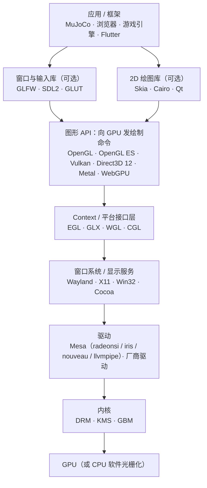
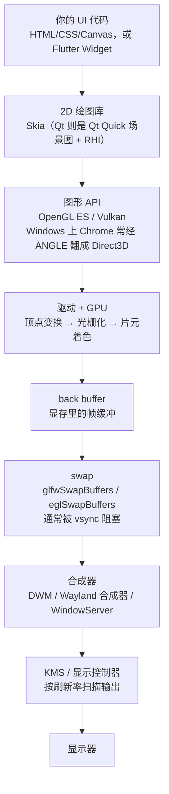
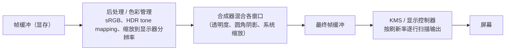
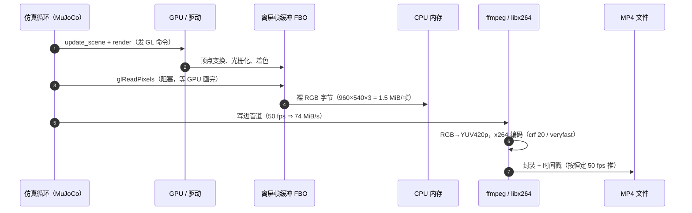

# 图形 / 渲染 / 视频 栈速查

> 目的：把" GPU 画图"这件事的各个名词放到一张分层图上，标出 **MuJoCo 在哪一层**。 相关文档：[`mujoco-notes.md`](mujoco-notes.md)（第 7 节讲 `MUJOCO_GL` 与渲染开销）、 任务记录 [`@20260923_mujoco/README.md`](../@20260923_mujoco/README.md)。

---

## 1. 分层图

记住三条"同一层里的兄弟"，剩下的就好记了：

| 层 | 兄弟 | 平台 |
|---|---|---|
| 图形 API | OpenGL / Vulkan / Direct3D / Metal | 跨平台 / 跨平台 / Windows·Xbox / Apple |
| Context 接口 | **EGL** / GLX / WGL / CGL | 跨平台（含离屏）/ X11 / Windows / macOS |
| 窗口库 | GLFW / SDL2 / GLUT | 跨平台（都只建窗口和 context，自己不渲染） |

---

## 2. 各层的名字是什么意思

### 2.1 图形 API（"你写代码调的那一层"）

| 名字 | 全称 / 来历 | 干什么 |
|---|---|---|
| **OpenGL** | *Open Graphics Library*，1992 年由 SGI 的 IRIS GL 演化而来，现由 Khronos 维护 | 跨平台的 3D 图形 API。风格是"**状态机**"：设好状态、发绘制命令。桌面版最广为人知 |
| **OpenGL ES** | *OpenGL for **E**mbedded **S**ystems* | OpenGL 的嵌入式精简版（去掉老式即时模式等），手机 / 浏览器 / 嵌入式的事实标准。MuJoCo 的离屏渲染（`mjr_*` 那套）就走 GL / GLES |
| **Vulkan** | Khronos 2015 年发布，名字沿用 Vulcan/MoltenVK 的梗 | 下一代**显式** API：显存、同步、多线程都要自己管，换来做更少的驱动猜测和更高的性能。Android 现在默认它 |
| **Direct3D / DirectX** | **DirectX 是微软整套多媒体 API 家族的名字**（Direct3D 管 3D、DirectSound 管音频、DirectInput 管输入…），其中 **Direct3D 12** 是低层显式 API | Windows / Xbox 上的图形 API。说"DirectX"其实通常指 Direct3D |
| **Metal** | Apple 的 GPU API | macOS / iOS |
| **WebGL / WebGPU** | WebGL ≈ 浏览器里的 OpenGL ES；WebGPU 是浏览器里的新一代（对标 Vulkan/D3D12 的思路） | 网页里的 GPU 访问 |

### 2.2 2D 绘图库（"画形状/文字/图片"，本身不是 GPU API）

| 名字 | 是什么 |
|---|---|
| **Skia** | Google 的开源 **2D 图形库**（官方自称 *The 2D Graphics Library*），是 Chrome / ChromeOS / Android / Flutter 的图形引擎。它负责"把一个圆角矩形、一段文字、一张图片画出来"这种高层语义，**底下再走 OpenGL / Vulkan / Metal 或纯 CPU 软件光栅**。所以 Skia 和 DirectX 不在同一层：DirectX 是 API，Skia 是用 API 的库 |
| **Cairo / Qt** | 同类或更上层：Cairo 是 2D 矢量绘图库；Qt 是应用框架（内部有自己的 RHI 抽象层） |
| **ANGLE** | *Almost Native Graphics Layer Engine*（Google，Chromium 项目）。它是一个**翻译层**：把 OpenGL ES 调用翻译成目标平台已有的 API（Windows 上翻成 Direct3D，也可翻成 Vulkan / 桌面 GL / Metal）。Chrome 和 Firefox 在 Windows 上的 WebGL 默认就走它；它同时提供一份 **EGL 1.5 的实现**。附带的 shader 编译器还能把 GLSL 翻成 HLSL / SPIR-V 等 |

### 2.3 Context / 平台接口层（"怎么拿到一个可以画画的 context"）

| 名字 | 全称 | 干什么 |
|---|---|---|
| **EGL** | *Khronos Native Platform Graphics Interface*（EGL 1.2 起的规范名；之前叫 *OpenGL ES Native Platform Graphics Interface*；X.Org 术语表写作 *Embedded-System Graphics Library*） | 管理 GL context / surface 的创建、绑定与同步。**关键：它也能渲染到离屏 buffer**，所以没有显示器、没有窗口也能渲染（本仓库录像就靠这个） |
| **GLX / WGL / CGL** | GLX = *OpenGL Extension to the X Window System*；WGL = Windows 的 GL 接口；CGL = *Core OpenGL*（macOS） | 同一层的老接口，各自绑定自己的窗口系统 |
| **Vulkan 的对应物** | Vulkan 不用 EGL/GLX/WGL，**自带 surface/WSI**（Window System Integration）；但"从窗口拿到可绘制表面"那一步仍是平台相关代码 | |

### 2.4 窗口 / 输入库（"帮你建窗口、收键盘"）

| 名字 | 是什么 |
|---|---|
| **GLFW** | *Graphics Library Framework*：跨平台的窗口 + GL context + 输入库（Windows / macOS / Wayland / X11）。它的 FAQ 明确列了"**不是** OpenGL 的实现、**不渲染任何东西**"。MuJoCo 的 `launch_passive` 交互窗口就是它 |
| **SDL2 / GLUT** | 同类。SDL 更重（还管音频、事件循环）；GLUT 是上古 API，freeglut 是它的开源实现 |

**一个容易搞混的细节**：GLFW 在 Linux 上**自己就是用 EGL/GLX 建 context 的**——官方 FAQ 的 "What window system APIs does GLFW use?" 写着：

* Wayland → 输入用 Wayland，**context 用 EGL**；
* X11 → 输入用 Xlib，**context 用 GLX 或 EGL**；
* Windows → Win32 + **WGL 或 EGL**；macOS → Cocoa + NSOpenGL。

所以"GLFW 下面是 EGL"在 Wayland 上确实成立；但它们的关系是"**窗口库调用平台接口**"， 而 MuJoCo 的 `MUJOCO_GL` 只是在"自己直接选一条路拿 context"时给你二选一 —— `glfw`（让 GLFW 搞定一切）或 `egl` / `glx` / `osmesa`（自己走那条接口）。

### 2.5 驱动 / 内核 / 硬件

| 名字 | 是什么 |
|---|---|
| **Mesa** | Linux 上 OpenGL / **OpenGL ES** / Vulkan / EGL / OpenCL 的**开源实现**（不是驱动本身，而是"API 的软件实现 + 一堆厂商驱动"）。Intel 在 Linux 上只用 Mesa（`iris`/`crocus`/`i965`），AMD 官方用 Mesa（`radeonsi`/`radv`），NVIDIA 有社区反向工程驱动 `nouveau`/`nvk`。它还带**纯软件渲染**：`llvmpipe`（OpenGL）、`lavapipe`（Vulkan）、`OSMesa`（离屏） |
| **DRM / KMS / GBM** | Linux 内核的显示子系统：DRM = *Direct Rendering Manager*（显存/命令提交），KMS = *Kernel Mode Setting*（显示模式设置），GBM = *Generic Buffer Management*（缓冲分配，Wayland 合成器常用）。**Wayland 客户端就是通过 EGL + GBM 直接画进 framebuffer 的** |
| **厂商驱动** | NVIDIA/AMD 的闭源驱动等，实现了同样的 API，但直接和自家硬件对话 |

### 2.6 计算（不是"画图"，但常一起出现）

| 名字 | 是什么 |
|---|---|
| **CUDA / OpenCL / compute shader** | GPU 通用计算：CUDA 是 NVIDIA 专属；OpenCL 跨厂商；compute shader 是 Vulkan/D3D12/Metal 里顺带做计算的路子 |
| **JAX(XLA) / Warp** | MuJoCo 的 GPU 仿真支线：**MJX** 用 JAX（底层经 XLA 编到 CUDA），**MJWarp** 用 NVIDIA Warp。都需要较新的卡（本机 MX350 是 sm_61，两者都用不了） |

### 2.7 着色器与"最后一步：编码"

| 名字 | 是什么 |
|---|---|
| **GLSL / HLSL / MSL** | 写 shader 的语言：GLSL（GL/GLES 用）、HLSL（Direct3D 用）、MSL（Metal 用）。写法高度相似 |
| **SPIR-V** | Khronos 的 shader **中间字节码**：GLSL/HLSL 都能编成它，再交给 Vulkan 等消费 |
| **ffmpeg / libx264** | 跟上面整条渲染栈**无关**：它只是把 MuJoCo 渲染出来的 RGB 帧（每帧 1.5 MB 的裸数据）**编码**成 H.264 MP4。本仓库录像链路 = `Renderer` 出帧 → 管道给 ffmpeg → `libx264` 编码 |

---

## 3. 一个普通桌面窗口应用是怎么画出一帧的

以 **Electron（Chromium）** 或 **Flutter 桌面**为例：

四个常被忽略的点：

* ②～④ 里 CPU 只是「发命令」，真正画像素的是 GPU，而且是**异步**的（所以 `glReadPixels`/ swap 这类“要结果”的调用才特别贵）；
* ⑤ 的 swap 通常**阻塞到显示器刷新**（vsync，60/120 Hz）—— 这直接解释了为什么 MuJoCo 里 每步调 `viewer.sync()` 会把仿真钉在 10% 实时（见 [`mujoco-notes.md` 第 7 节](mujoco-notes.md)）；
* ⑥ 是**应用之外**的事：普通应用并不直接把像素送到屏幕（全屏独占例外），必须经过合成器；
* 窗口重绘是**事件驱动**的（鼠标、动画定时器、resize），不是“无条件每帧重画”。

三条常见技术栈的差别其实很小：

| 技术栈 | 2D / UI 层 | 图形 API | 窗口与输入 |
|---|---|---|---|
| Electron | Chromium 的 Blink + Skia | GL ES（Windows 上经 ANGLE→D3D）、Vulkan、Metal | 自带窗口层（Linux 上走 X11/Wayland） |
| Qt（Quick） | Qt Quick 场景图 + Qt RHI | OpenGL（默认）、Vulkan、Metal、D3D11/12 | Qt 自己的平台插件 |
| Flutter 桌面 | Skia（Widget → 图层 → 绘制） | OpenGL / Vulkan / Metal | Flutter engine 自建 |
| **MuJoCo viewer** | **没有**（只有 3D） | OpenGL | **GLFW** |

## 4. MuJoCo 渲染走的是同一条路吗？

**部分相同：** 从「图形 API → 驱动 → GPU → 帧缓冲」这一段完全一样（甚至用的还是更老的 OpenGL，不是 Vulkan）。**不同的在后面：帧给谁、什么时候给、要不要上屏。**

| | 普通窗口应用 | MuJoCo `Renderer`（本仓库录像） | MuJoCo `launch_passive` 窗口 |
|---|---|---|---|
| 谁驱动“画下一帧” | 事件循环 / 动画计时器（60~120 Hz） | **仿真循环**：每个 `mj_step` 后按需取帧（`capture()` 按 `data.time` 节流） | 同左，但每 N 步 `viewer.sync()` 才上屏 |
| 画到哪 | 窗口的 back buffer | **离屏 FBO**（尺寸由 `offwidth/offheight` 决定） | 窗口的 back buffer |
| 怎么“交付” | `swap` 给合成器 | **`glReadPixels` 回读到 CPU 内存** → 送 ffmpeg | `swap`（和普通应用一模一样） |
| 受 vsync 影响吗 | 是 | **否**（离屏没有刷新概念） | 是（所以 sync 要降频） |
| 需要窗口系统吗 | 需要 | **不需要**——EGL 就够了（无显示器也能跑） | 需要（GLFW） |

一句话：**MuJoCo 的离屏渲染是“给数据拍快照”，不是“给用户画界面”。** 它没有事件循环、 没有合成、没有脏区域重绘，所以比 UI 应用简单得多；一旦你把它接到 `launch_passive` 窗口， 它就又变回一个普通的 GLFW 窗口应用了（只是循环频率由 `timestep` 决定，可能是 500 Hz， 而屏幕还是 60 Hz）。

## 5. 光栅化之后还有哪些环节？

有，而且分两条完全不同的路。

### 5.1 上屏路径（每帧都要走一遍）

其中的关键机制：

* **双/三缓冲**：前台 buffer 正在被扫描输出时，你就得画到后台 buffer；
* **vsync**：swap 等到扫描到安全时刻才生效，否则画面会被撕成两半（tearing）；代价是帧率被钉在刷新率上；
* **合成器**：多窗口、透明度、圆角阴影、系统级缩放都在这一步完成（Windows DWM / Wayland compositor / macOS WindowServer）。

### 5.2 变成视频文件的路径（本仓库走的）

这是一条**有先后顺序**的流水线，所以用时序图更贴切（横轴是时间）：

**谁负责哪一段：**

| 环节 | 谁干的 | 跟 GPU 有关吗 |
|---|---|---|
| 渲染 / 光栅化 | MuJoCo + 驱动 + GPU | 是（可用 `MUJOCO_GL=osmesa` 改成 CPU 软光栅）|
| 回读 `glReadPixels` | MuJoCo Python 绑定 | 是（而且要等 GPU 完成）|
| 管道传输 + 编码 | 系统 ffmpeg + libx264 | **否，纯 CPU** |
| 封装 / 播放 | ffmpeg / 播放器 | 否 |

实测（960×540，本机 `MUJOCO_GL=egl` → **NVIDIA MX350**）：**渲染 + 回读 5.5 ms/帧**， 整条「渲染 + 回读 + 编码」**7.1 ms/帧** —— 其中编码与管道只占 **~1~2 ms**。 **大头是渲染，不是编码**（详见 [`mujoco-notes.md` 第 7.2 节](mujoco-notes.md)）。

## 6. MuJoCo 在这张图的哪里

| MuJoCo 的功能 | 落在哪一层 |
|---|---|
| **物理仿真本体** | **不在这张图上**：纯 CPU 计算（用 SIMD + 多线程），没有 GPU 版本 |
| 离屏渲染 `mujoco.Renderer` / `mjr_*` | 图形 API 层的 **OpenGL**（内部实现是 GL/GLES 那套） |
| 选"走哪条路拿 GL context" | **`MUJOCO_GL`**：`glfw` / `egl` / `glx` / `osmesa`（+ Windows/macOS 的 `wgl`/`cgl`）。见 [`mujoco-notes.md` 第 7 节](mujoco-notes.md) |
| `launch_passive` 交互窗口 | **GLFW**（+ 其背后的 EGL/GLX） |
| 录像成 MP4 | `Renderer` 出 RGB 帧 → **ffmpeg/libx264**（栈外） |
| GPU 加速仿真（MJX / MJWarp） | 计算层（**JAX / Warp**），不是渲染层 |
| `mujoco-simulate` GUI | MuJoCo 自带的 C++ 程序，同样走 GLFW + OpenGL |

一句话：**MuJoCo 本体是 CPU 的，GPU 只在"渲染"和"MJX/MJWarp"两条支线里出现**， 而渲染那条支线里，`MUJOCO_GL` 决定的是"**用谁把 GL context 交给我**"。

---

## 7. 容易混淆的几点

1. **DirectX ≠ Direct3D**：前者是家族（音频、输入都算），3D 渲染叫 Direct3D。
2. **Skia 不是 GPU API**：它是 2D 图形库，下面照样走 OpenGL/Vulkan/Metal。
3. **GLFW 不是图形 API**：它只建窗口和 context，渲染一行都不做。
4. **OpenGL 是"规范"，不是某个文件**：实现由驱动（Mesa / NVIDIA）提供；所以"OpenGL 版本"实际上是驱动支持的版本。
5. **EGL / GLX / WGL / CGL 是四胞胎**：同一层、四套窗口系统；Vulkan 把它们换成了自己的 WSI。
6. **ANGLE 是翻译层**：浏览器里写 GLES，Windows 上可能实际跑的是 Direct3D。
7. **"离屏渲染"不需要窗口**：EGL 可以只创建离屏 buffer —— 这是服务器/无显示器环境能出图的关键。
8. **视频编码不在渲染栈里**：MP4 是 ffmpeg/libx264 干的，跟 GPU 无关（本机实测：960×540 一帧编码约 1~2 ms，而渲染要 5.5 ms —— 大头是渲染）。
9. **光栅化 ≠ 看到画面**：中间还隔着回读/合成/扫描输出（上屏）或回读/编码/封装（存文件），
   见 §5；GPU 画完只是“像素在显存里”。
10. **vsync 不是“性能优化”**：它是防撕裂的同步机制，代价是把帧率钉在刷新率上；
    对仿真来说，这意味着“上屏”会反过来限制仿真速度（所以 `viewer.sync()` 要降频）。
