# 运行时时序：线程、锁与每帧阻滞

本文是 [`unitree-mujoco.md`](unitree-mujoco.md) 的展开版：笔记里只留三条业务主干与结论，**所有"完整展开"的图放这里**。引用约定同笔记 —— `文件:行`，路径基线是 `ReadOnly.d/unitree_mujoco`（conda 环境里的头文件写成 `$INC/...`；`ReadOnly.d/unitree_sdk2`、`ReadOnly.d/unitree_sdk2_python` 这两份 SDK 源码也在本机，它们自己的文件写仓库内路径）。 任务背景见 [`../../@20260923_mujoco/README.md`](../../@20260923_mujoco/README.md)；文档索引见 [`../../README.md`](../../README.md)。§1–§10 拆的是 unitree_mujoco 自己的线程与锁；**§11 把我们实际跑过的五种方案（含我们自己的 Python / C++ 实现）放在同一把尺子上，比较每帧「谁在等谁」**，回答“某种改法到底有没有提高性能”那类问题。

覆盖范围：**§1–§10 只讲它直接创建或参与管理的进程与线程**（不含操作系统/显卡驱动线程，不含离线工具 `terrain_tool/terrain_generator.py`——它只生成 hfield 资源、不参与运行期）。§11 例外：为了对比，那里把我们自己的程序也画了进来；§12 只是一张索引表。

## 1. 进程与线程总表

```mermaid
flowchart TB
    subgraph CS["进程① C++ 仿真器：./unitree_mujoco"]
        direction TB
        C1["主线程：Simulate::RenderLoop（UI + 渲染）"]
        C2["PhysicsThread：mj_step + 节奏对齐"]
        C3["UnitreeSdk2BridgeThread：等 d 就绪 → 建桥 → 保活"]
        C4["桥的 1 kHz RecurrentThread：ctrl 换算 + 填状态"]
        C5["发布线程 ×3（G1 再 +2）：RealTimePublisher::publishingLoop"]
        C6["（SDK / 中间件内）DDS 接收与发现线程"]
    end
    subgraph PS["进程② Python 仿真器：python3 unitree_mujoco.py"]
        direction TB
        P1["主线程：调 launch_passive，起完两个手写线程即结束"]
        P2["viewer UI 守护线程：launch_passive 内部创建"]
        P3["SimulationThread：建 DDS 桥 + mj_step"]
        P4["PhysicsViewerThread：viewer.sync()"]
        P5["RecurrentThread ×3：lowstate / highstate / wireless"]
        P6["ch_reader 守护线程：LowCmd 队列消费（回调在此）"]
        P7["（中间件内）DDS 接收与发现线程"]
    end
    subgraph CC["进程③④ 控制程序：C++ stand_go2 / Python stand_go2.py"]
        direction TB
        X1["主线程"]
        X2["writebasiccmd 定时线程（仅 C++ 示例）"]
    end
    BUS["DDS 总线：回环网卡 UDP（domain_id 1）<br/>rt/lowcmd ← 控制程序 · 仿真器 → rt/lowstate / rt/sportmodestate / rt/wirelesscontroller"]
    C5 --> BUS
    C6 <--> BUS
    P5 --> BUS
    P6 <--> BUS
    P7 <--> BUS
    BUS --> X1
    X2 --> BUS
```

| 进程 | 谁创建 | 线程清单 | 证据 |
|---|---|---|---|
| ① C++ 仿真器 `./unitree_mujoco` | 用户（`-r`/`-s` 选机器人/场景） | 主线程、`PhysicsThread`、`UnitreeSdk2BridgeThread`、桥的 1 kHz `RecurrentThread`、**每个 publisher 1 个发布线程**、DDS 库内线程 | `main.cc:695`（桥线程）、`:698`（物理线程）、`:701`（RenderLoop）、`bridge.h:170-171`（1 kHz）；发布线程来自 `RealTimePublisher` 构造函数里的 `std::thread(&RealTimePublisher::publishingLoop, this)`（`unitree_sdk2: include/unitree/dds_wrapper/common/Publisher.h`） |
| ② Python 仿真器 `python3 unitree_mujoco.py` | 用户 | 主线程（很快结束）、viewer UI 守护线程、`SimulationThread`、`PhysicsViewerThread`、3 个 `RecurrentThread`、`ch_reader` 守护线程、DDS 库内线程 | `unitree_mujoco.py:38`（SimulationThread）、`:70`（PhysicsViewerThread）；UI 线程见 conda 包里的 `mujoco/viewer.py:575`、`:586`；3 个定时器见 `unitree_sdk2py_bridge.py:63`、`:71`、`:81`；`ch_reader` 见 `unitree_sdk2py/core/channel.py`（`queueLen > 0` 时 `Thread(..., name="ch_reader", daemon=True)`）；本机 2026-09-25 实测该进程共 **8 个线程**（多出的是被动 viewer 的内部线程 `Thread-1 (_launch_internal)`） |
| ③ C++ 控制程序 `example/cpp/stand_go2.cpp` | 用户 | 主线程 + `CreateRecurrentThreadEx("writebasiccmd", …, int(dt*1000000), …)` 定时线程 + DDS 库内线程 | `example/cpp/stand_go2.cpp:98` |
| ④ Python 控制程序 `example/python/stand_go2.py` | 用户 | 只有主线程：`while True` + `time.sleep` 自己节拍 | `example/python/stand_go2.py:53`、`:86` |

三条容易搞错的点：

- **"三线程"只是业务线**（物理 / UI / DDS 桥），不是线程总数。C++ 侧光是 publisher 就再带 3 个线程（`lowstate`、`highstate`、`wireless`；G1 另有 `bmsstate`、`secondary_imu` 两个），再加 SDK 与中间件内部线程，实际线程数 7 个以上。
- **Python 侧的发布没有后台线程**：`ChannelPublisher.Write()` 直接调 `cyclonedds` 写（`unitree_sdk2py/core/channel.py` 的 `__Writer.Write`），周期由 `RecurrentThread` 提供。所以"C++ 有发布线程、Python 没有"是一条真实的结构差异。
- **Python 侧的订阅**因为有队列（`Init(self.LowCmdHandler, 10)`）而多一个 `ch_reader` 守护线程，回调跑在它上面；C++ 侧同构（带队列 → SDK 自建线程 `rlsnr`，`queueLen=0` 才走 DDS 接收线程 `recvUC`，见 §10）。

## 2. DDS 接口与消息（两版共用）

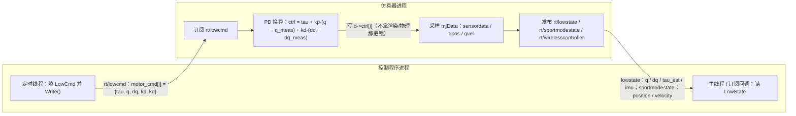

| 项 | 值 | 说明 |
|---|---|---|
| 域与网卡 | `domain_id: 1`、`interface: "lo"` | `simulate/config.yaml`；Python 侧 `simulate_python/config.py` 同值 |
| 下行 | `rt/lowcmd` | 每个电机 `{tau, q, dq, kp, kd}`；订阅侧做 PD 换算，物理侧永远只吃力矩 |
| 上行 | `rt/lowstate`、`rt/sportmodestate` | 电机 `q/dq/tau_est` + IMU（桥里顺便算 rpy）；机身位置/速度 |
| 上行（G1 另加） | `rt/lf/bmsstate`、`rt/secondary_imu` | `bridge.h:272`、`:275`；Python 版没有 |
| 手柄 | `rt/wirelesscontroller` | 用 `/dev/input/js0` 的实体手柄顶替真机遥控器（见笔记 §1.1） |
| 时间戳 | `tick = round(d->time / 1e-3)` | `bridge.h:225`，是**仿真时间**而非墙钟 |
| 发布方式 | C++：`RealTimePublisher` 后台线程；Python：调用者直接写 | 见 §9 |

## 3. C++ 仿真器内部：线程、共享数据与锁

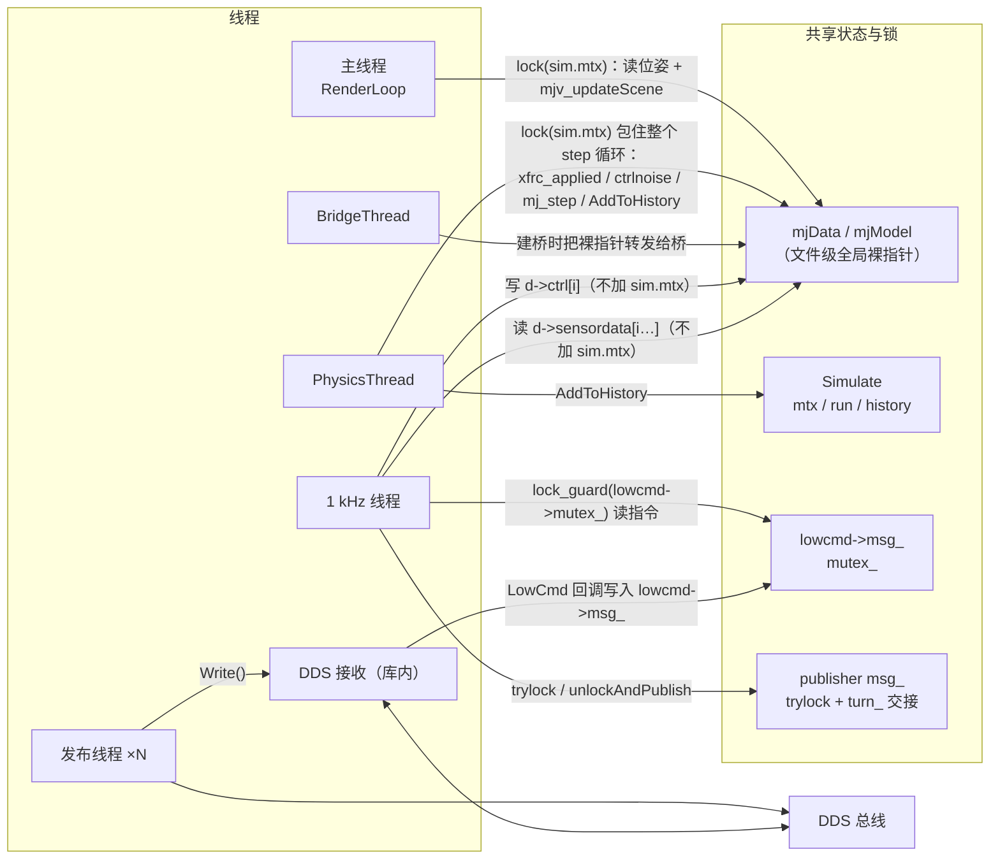

| 线程 | 拥有 / 读写什么 | 同步手段 | 证据 |
|---|---|---|---|
| 主线程 `RenderLoop` | 读 `mjData` 组装场景、渲染、处理键鼠 | `sim.mtx` | `simulate.h:86`、`main.cc:701` |
| `PhysicsThread` | `mjModel`/`mjData` 的创建与销毁、`mj_step`、elastic band、噪声、history | `sim.mtx` 包整个循环 | `main.cc:327`、`:538`、`:413`、`:464`、`:505`、`:519`、`:531`、`:498-500` |
| `BridgeThread` | 等 `d`、`ChannelFactory::Init`、选 IDL 建桥、之后空转 | 无（轮询 + `sleep`） | `main.cc:573-617`、`:576-583`、`:598-609`、`:613-615` |
| 1 kHz 线程 | 读写 `mjData`（`ctrl` 与 `sensordata`）、填三种状态消息、读手柄 | 只拿 `lowcmd->mutex_` 与 publisher 的 `trylock` | `bridge.h:170-171`、`:177`、`:180-185`、`:190-194`、`:225` |
| 发布线程 ×N | 复制 `msg_` 并 `Write()` | `mutex_` + `turn_` 原子交接 | `unitree_sdk2: include/unitree/dds_wrapper/common/Publisher.h` |
| DDS 接收（库内） | 把收到的 `LowCmd` 交给回调（**2026-09-25 实测：回调在 SDK 自建线程 `rlsnr`，只有 `queueLen=0` 才跑在这里的 `recvUC`**，见 §10） | 库内部 | 同上 |

**没有画进图、但要知道的两件事**：① 换模型（UI 拖拽/打开文件）会在物理线程里 `mj_deleteData/Model` 再新建（`main.cc:352-353`、`:382-383`），此时桥手里的裸指针就悬垂了；② 全局变量只有两个裸指针（`main.cc:99-100`），没有任何所有权封装。

## 4. Python 仿真器内部：线程、共享数据与锁

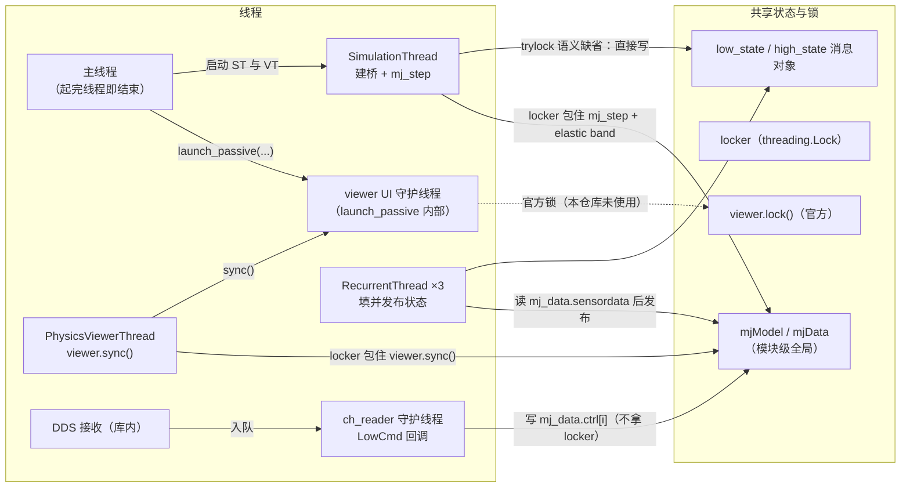

| 线程 | 拥有 / 读写什么 | 同步手段 | 证据 |
|---|---|---|---|
| 主线程 | 建 viewer、启动两个手写线程 | 无 | `unitree_mujoco.py:79-83`（`__main__` 块） |
| UI 守护线程（实测名字 `_launch_internal`） | GLFW 事件与绘制 | 库内部 | `mujoco/viewer.py:575`、`:586` |
| `SimulationThread` | 初始化 DDS 桥、`mj_step`、elastic band | `locker` | `unitree_mujoco.py:38`、`:52-61` |
| `PhysicsViewerThread` | `viewer.sync()` 与节流睡眠 | 同一把 `locker` | `unitree_mujoco.py:70`、`:72-74` |
| `RecurrentThread` ×3 | 读 `sensordata` 填消息并发布 | publisher 自身（无后台线程） | `unitree_sdk2py_bridge.py:63`、`:71`、`:81` |
| `ch_reader` | 消费队列并调用 `LowCmdHandler` → 写 `mj_data.ctrl[i]` | 无（拿不到 `locker`） | `unitree_sdk2py_bridge.py:111-123`、`unitree_sdk2py/core/channel.py` |
| DDS 接收（库内） | `on_data_available` → 入队 | 库内部 | 同上 |

与 C++ 版的两条结构差异：**① 发布没有后台线程**（少 3 个线程）；**② 多一个 `ch_reader`**（多 1 个线程）。净效果是线程数接近，但**回调跑在哪个线程上不同**，这是分析竞态时最容易被忽略的一点。

## 5. 启动握手时序

C++ 版（`main` 先把三个线程拉起来，靠轮询对齐顺序）：

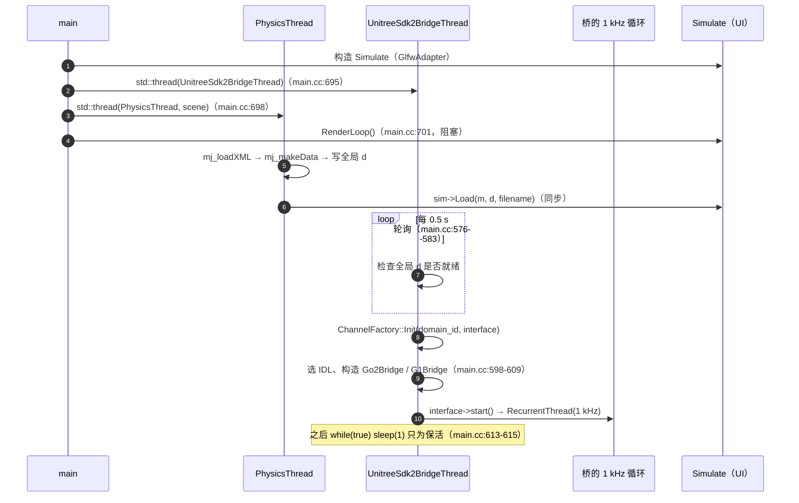

Python 版（没有轮询握手，靠固定 `time.sleep(0.2)` 让 viewer 先起来）：

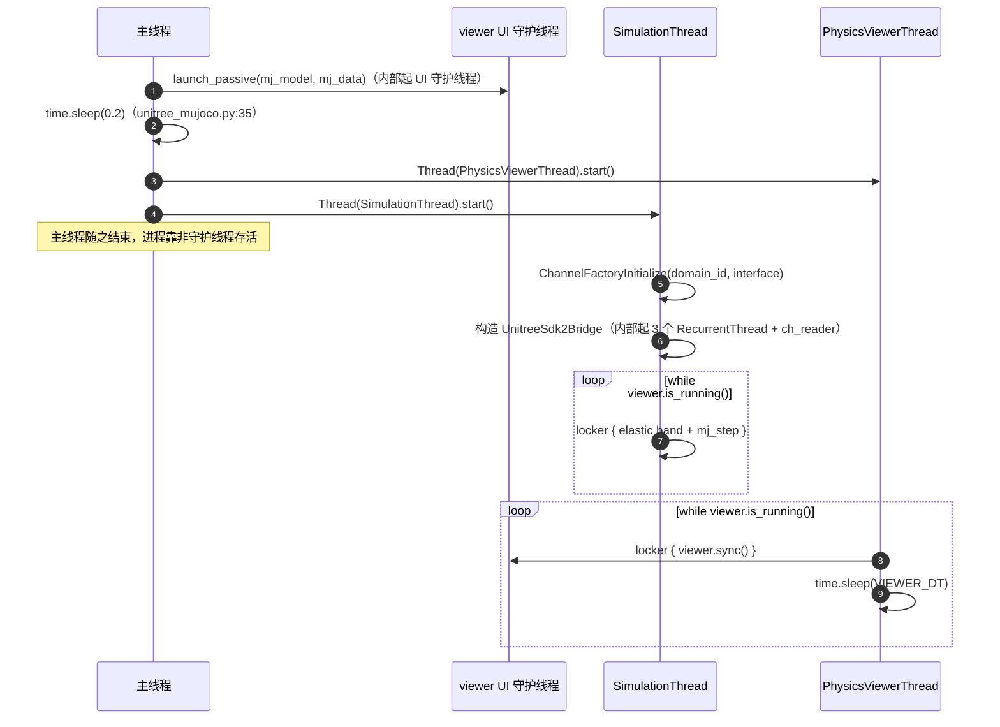

## 6. 稳态一步时序（细节版）

C++ 版：三边同时碰 `mjData`，而且**桥那一路不认 `sim.mtx`**。

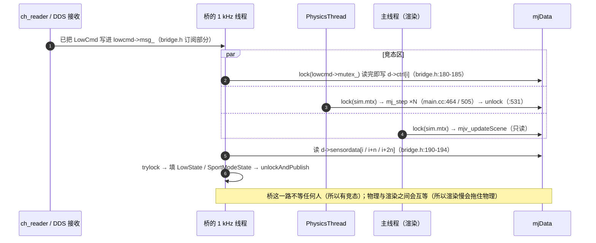

Python 版：一把 `locker` 把 `mj_step` 与 `viewer.sync()` 串起来，而控制写入在 `ch_reader` 上、拿不到这把锁。

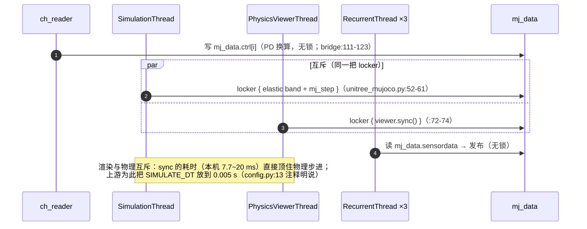

## 7. 退出 / 停止时序

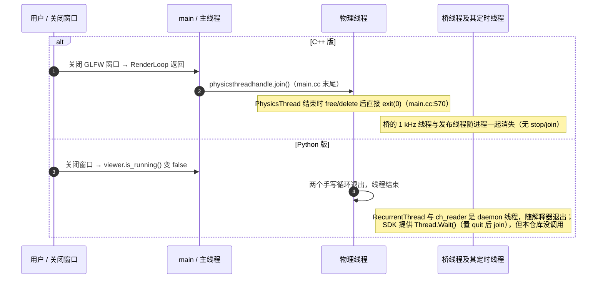

| 收尾动作 | C++ | Python |
|---|---|---|
| 物理循环退出条件 | `sim.exitrequest` / 窗口关闭 | `while viewer.is_running()` |
| 停止信号 | 无统一的 `stop()`，靠 `exit(0)` | 自己的 `__quit` 标志 / daemon 退出 |
| 已存在的优雅路径 | `~RealTimePublisher()` 会 `stop()` 并 `join()` 发布线程 | `Thread.Wait(timeout)`（未被调用） |
| 证据 | `main.cc:570`、Publisher.h | `unitree_mujoco.py:49`、`:71`、`unitree_sdk2py/utils/thread.py` |

## 8. 我们的目标设计（简版，详版见笔记 §8）

笔记 §8 那张图就是结论，这里只补一句衔接：**上游其实已经用过我们想要的模式** —— `RealTimePublisher` 的 `trylock()` / `turn_` / `publishingLoop` 就是 ROS `realtime_tools` 的"实时侧只交接、非实时线程负责真正发送"，等价于"双缓冲 + 谁负责搬运"。我们把它推广到**三个方向**（控制输入、状态快照、渲染读取），并把"谁占哪块内存"写成职责表。

## 9. 上游的双缓冲先例：`RealTimePublisher`

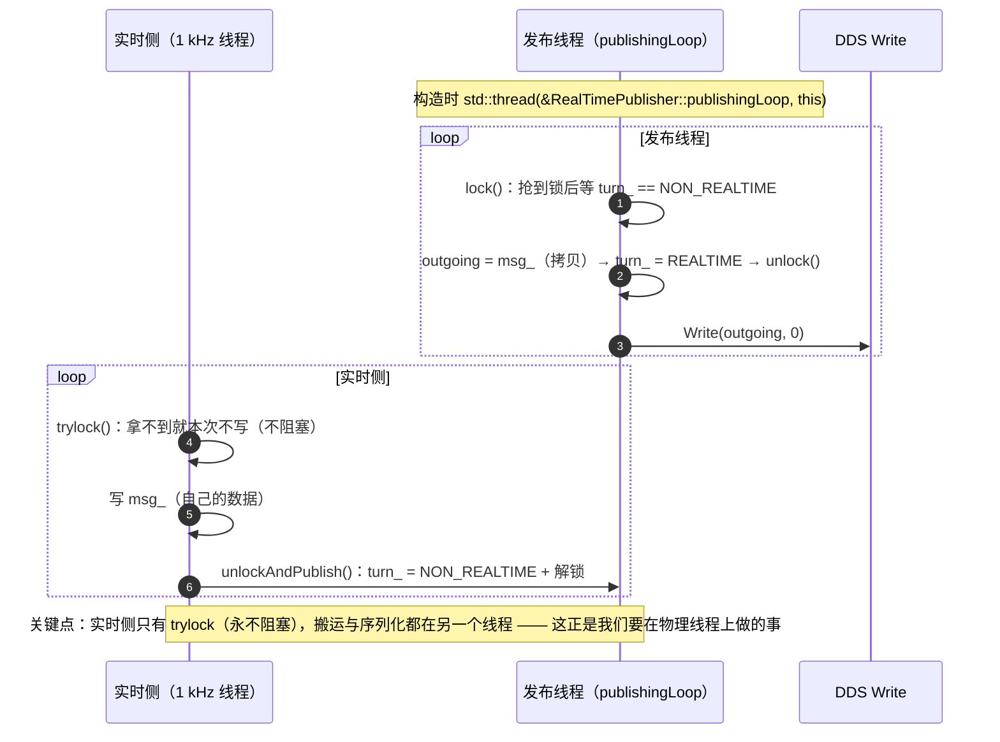

## 10. 核实结果与复核方法

**已核实（2026-09-25，本机运行期实测）**：带队列订阅（上游 C++ 用的 `InitChannel(handler, 10)`）的回调跑在 **SDK 自建的线程**上；`queueLen=0` 时才跑在 **Cyclone DDS 的接收线程**上。两种语言同构，名字不同：

| | `queueLen = 0`（监听者直调） | `queueLen > 0`（上游采用） |
|---|---|---|
| C++ | Cyclone DDS 接收线程 `recvUC` | SDK 自建线程 `rlsnr` |
| Python | Cyclone DDS 内部线程（`Listener(on_data_available=…)` 直接调 handler） | SDK 自建 `ch_reader` 守护线程（`core/channel.py`：`queueLen > 0` 时 `Thread(…, name="ch_reader", daemon=True)`） |

证据是两条运行期打印，不是读源码推断（C++ SDK 的实现主体在预编译的 `libunitree_sdk2.a` 里，读不到；Python 侧可读源码，但也用同一手段交叉确认）：

```text
[probe] rt/lowcmd queueLen=0  -> 回调线程 tid=138692570097216 name='recvUC'
[probe] rt/lowcmd queueLen=10 -> 回调线程 tid=138692561704512 name='rlsnr'
[probe] LowCmdHandler 首次执行于线程 name='ch_reader' ident=128441680619072 daemon=True   # Python 侧
```

复核命令（探针是本项目自己写的、挂在 `Replicate.d/unitree_mujoco/cpp/probe_lowcmd.cpp`，不改上游源码：它同时挂 `queueLen=10` 与 `queueLen=0` 两个订阅者，第一次回调时打印 `pthread_getname_np`）：

```bash
# 先跑上游仿真器与 example/cpp/stand_go2，再跑探针（环境搭建见 ../pitfalls/environment.md）
./probe_lowcmd 20
```

顺带把仿真器进程的线程清单也测了（Python 侧同一次运行里 `threading.enumerate()` 的实测结果，共 **8 个**线程）：

```text
[('MainThread', False), ('Thread-1 (_launch_internal)', True), ('Thread-3 (PhysicsViewerThread)', False),
 ('Thread-4 (SimulationThread)', False), ('sim_lowstate', True), ('sim_highstate', True),
 ('sim_wireless_controller', True), ('ch_reader', True)]
```

后 4 个都是 SDK/桥接层起的守护线程；`Thread-1 (_launch_internal)` 是被动 viewer 自己的 UI 线程（`mujoco.viewer.launch_passive` 内部起的），不在上游代码里。**“3 线程”只描述业务主干，加上这些才是进程的真实线程数**。

### 10.1 仍未核实 / 复核方法

| 待核实项 | 现状 | 怎么核 |
|---|---|---|
| **C++ 侧 `LowCmd` 回调跑在哪个线程**（DDS 接收线程？还是 SDK 的 reader 线程？） | **已核实（2026-09-25）**：带队列（上游的 `InitChannel(handler, 10)`）→ SDK 自建线程 `rlsnr`；`queueLen=0` → DDS 接收线程 `recvUC` | 已完成，证据与命令见本节上文 |
| C++ publisher 的数量随机型变化（Go2 3 个，G1 5 个） | 已核实类层次，未数 G1 的完整清单 | 数 `bridge.h` 里 `G1Bridge` 构造的元素 |
| Cyclone DDS 内部线程的名字与个数 | 名字随实现/配置而异（本机实测接收线程叫 `recvUC`），**不属于本仓库设计** | 需要时以 `cyclonedds` 文档为准；图中除已实测处外仍统一写"库内部" |

## 11. 五种方案的「每帧阻滞」对比

§1–§9 拆的是上游自己的线程与锁。这一节换个问法：**一帧的时间里，谁在等谁**。实时性好坏只取决于两件事，而不取决于物理快不快（`mj_step` 本机实测 0.0432 ms/步，C++ 侧 0.0404 ms/步——物理从来不是瓶颈）：

1. **渲染期间物理能不能推进**？渲染若独占锁或占着同一个线程，物理的时间轴就被帧率钉住；
2. **物理持锁期间渲染要等多久**？只等一次 memcpy，帧率几乎无感；等一整个 step 批次（上游按 `simRefreshFraction / refresh_rate = 0.7 / 60 ≈ 11.7 ms` 成批推进），帧就会晚一拍。

设渲染一次的开销 $R$（本机 `viewer.sync()` 中位 ≈23 ms；仓库更早的测量 7.7–20 ms，见 [`mujoco.md`](mujoco.md) §7.2）与步长 $dt$（上游 Python 0.005 s，其余 0.002 s）。

| # | 方案 | 线程 / 锁结构 | 渲染期间物理能推进吗 | 物理持锁期间渲染等多久 | 实时率（本机） |
|---|---|---|---|---|---|
| ① | unitree_mujoco C++ | 官方 `Simulate` 的 `simulate.cc` / `glfw_adapter.cc` **原样复用**（`simulate/CMakeLists.txt` 只排除官方的 `main.cc`），自己写 `PhysicsLoop` + SDK 桥线程 | **能**——官方 `RenderLoop` 在 `Render()` 之前就放锁 | 一个 step 批次（≤ `refreshTime` ≈ 11.7 ms） | 与官方样机同构：按 `percentRealTime` 自定速，机器跟得上就 ≈1x |
| ② | unitree_mujoco Python | 两个线程共用一把 `locker`；`SIMULATE_DT = 0.005`、`VIEWER_DT = 0.02`（50 fps） | **不能**——`PhysicsViewerThread` 把整个 `viewer.sync()` 放在锁内 | 一步（0.04 ms） | 同结构实测 **0.542x**（`physics_pacing.py` 用例 3，渲染 20 ms）；换成真机 `sync≈23 ms` 后结构上不变，且每周 43 ms 里有 23 ms 物理完全停摆 |
| ③ | 我们 C++（`cpp_task2 --mode view`） | 我们的物理线程 + 官方 `RenderLoop`（渲染在锁外）+ 自写墙钟节流（≤1x） | **能** | 一步的临界区（0.04 ms） | **1.00x 实测**（1 仿真秒 = wall 1.00 s） |
| ④ | 我们 Python（`python/` 双缓冲） | 物理线程独占 `mjData`，渲染读快照副本，锁只罩 memcpy | **能** | 一次 memcpy（µs 级） | **0.998x**（开窗口 ≈0.86x——那 0.14 是 GIL，不是锁） |
| ⑤ | 我们 Python baseline（`scripts/simulate.py`） | 单线程：一圈 = `mj_step` + `viewer.sync()` | 天然不能（同一线程串行） | 一整圈 | **0.089x**（23.1 ms/圈，只推进 2 ms） |

### 11.1 先把「那把锁」讲清：`sim.mtx` 罩着什么

官方 `Simulate` 只有一把锁：`SimulateMutex mtx`，而 `class SimulateMutex : public std::recursive_mutex {}`（`simulate.h:41`；`MutexLock = std::unique_lock<std::recursive_mutex>`）。**是递归锁**，因为 `RenderLoop` 持锁之后还会调用同样持锁的 `Sync()`。

它保护的是「物理状态 + 渲染要用的快照 + UI 状态」三类东西，具体到变量：

| 类别 | 变量 |
|---|---|
| 物理模型与数据 | `m_` / `d_`（正在跑的 model/data）、GUI 可改字段 `qpos_`·`qpos_prev_`·`ctrl_`·`ctrl_prev_`·`eq_active_*`、上一帧的 `mjopt_prev_`/`mjvis_prev_`/`mjstat_prev_`/`opt_prev_`/`cam_prev_`（判「变没变」用）、从模型建出来的索引表（`jnt_*`/`actuator_*`/`body_parentid_`/`ncam_`/`nkey_`/`state_size_`） |
| 时间轴与历史 | `history_` / `nhistory_` / `history_cursor_` / `scrub_index`（`AddToHistory` 不再自己加锁，因为调用它的物理线程已经持有） |
| 渲染快照 | `scn`（`mjvScene`）。**只在 `RenderLoop` 里更新场景那一段持锁**，`Render()`（真正的 GL 绘制 + `SwapBuffers`）在锁外——源码注释就写着 `// MutexLock (unblocks simulation thread)` |
| UI 状态 | `uistate` / `ui0` / `ui1`，以及 `pending_` 里那批「待执行动作」（保存 xml、reset、copy key…） |
| 加载协议 | `mnew_` / `dnew_` / `loadrequest` / `filename` 与条件变量 `cond_loadrequest`——`Load()` 就是在这把锁上等渲染线程把模型接走 |
| passive 模式的影子数据 | `m_passive_` / `d_passive_` / `user_scn_geoms_` |

**不走这把锁**的：跨线程消息用原子量（`exitrequest` / `droploadrequest` / `uiloadrequest` / `screenshotrequest`…）；播放控制字段（`run` / `real_time_index` / `measured_slowdown` / `busywait`）官方 `PhysicsLoop` 在锁内读，我们那个精简版在锁外读——`int`/`float` 的良性竞态，够用。

三个方案的那把锁，对比起来差别一眼可见：

| 方案 | 锁保护什么 | 绘制在不在锁里 |
|---|---|---|
| 官方 `Simulate`（①③） | 物理状态 + **场景快照** `scn` + UI 状态 + 加载协议 | **不在**（`Render()` 在锁外） |
| 上游 Python `locker`（②） | `mj_model` / `mj_data` 本身（`mj_step` 与 `viewer.sync()` 互斥） | **在**（整个 `viewer.sync()` 都在锁内） |
| 我们 Python 的快照锁（④） | 只有快照字典（`qpos`/`qvel`/`act`/`ctrl` 的 memcpy）；`physics_data` 归物理线程、`render_data` 归渲染线程各自独占 | 不在 |

所以「渲染顶不顶住物理」的根源就在最后一列：同样是「保护数据」，把**绘制**放不放进去，结果差一个量级。

### 11.2 每帧时序

下面这张图把五种方案**各画一轮**放在同一条时间轴上（横轴数值 = ms），方案按「一轮多长」**降序**自上而下排：**轮子越长 = 越慢**。每个方案内部按线程分行，条与条首尾相接表示接力（`after` 链），每轮以 `milestone` 收尾；🔴 红色（`crit`）的条是物理被顶住的那段时间。

写法上有两个坑（都在 Mermaid 11 实测过）：

- 用 `dateFormat X`（数值当 unix 秒 → 刻度数字即毫秒）+ `axisFormat %s` 时，`任务 : id, 起点, 终点` 里的**起点会被忽略**（条一律从 0 起算）。必须按官方文档的链式写法：每条给一个 id，锚定起点的那一条写 `id, 0, 时长`，其余写 `after <上一条id>, 时长`（时长要带单位；这里 1 单位 = 1 ms，所以写 `23s`）。链式写法同时也把「接力」关系画成了分行的一条条。
- `milestone` 同样用 `after <上一条id>, 时长` 定位（不给它绝对位置）。

```mermaid
gantt
    title 五种方案各跑一轮的耗时对比（横轴 = ms；一轮 = 一次循环，红色 = 物理被顶住）
    dateFormat X
    axisFormat %s
    tickInterval 5second
    section ② 上游 Python·物理线程（一轮 43 ms）
    自定速 4 步（dt=5ms，放大 dt 就是在迁就渲染） : p2a, 0, 20s
    等锁 → 物理完全停摆 23ms : crit, p2b, after p2a, 23s
    section ② 上游 Python·渲染线程
    空闲（锁没人拿，物理在跑） : p2c, 0, 20s
    viewer.sync()（含绘制，锁内）23ms : crit, p2d, after p2c, 23s
    ② 一轮 43 ms，物理只拿到 20 ms : milestone, p2m, after p2d, 1s
    section ⑤ baseline·唯一线程（一轮 24 ms）
    步进 1 步（放大到 1ms） : p5a, 0, 1s
    渲染 + swap，物理被顶住 23ms : crit, p5b, after p5a, 23s
    ⑤ 一轮 24 ms 只推进 2 ms 仿真 : milestone, p5m, after p5b, 1s
    section ① 上游 C++·物理线程（一帧 23 ms）
    成批 mj_step + 自定速（只在快照那一瞬让步） : p1a, 0, 23s
    section ① 上游 C++·渲染线程
    快照（锁内，µs 级，放大到 1ms） : p1b, 0, 1s
    渲染 + swap（锁外） : p1c, after p1b, 22s
    ① 一帧 23 ms（≈43 fps），物理一刻没停 : milestone, p1m, after p1c, 1s
    section ③ 我们 C++·物理线程（一帧 23 ms）
    每 2ms 一步 + 睡眠（墙钟节流 1x，从不等待渲染） : p3a, 0, 23s
    section ③ 我们 C++·渲染线程
    快照（锁内，µs 级，放大到 1ms） : p3b, 0, 1s
    渲染 + swap（锁外） : p3c, after p3b, 22s
    ③ 一帧 23 ms（≈43 fps），物理拿到全部 23 ms : milestone, p3m, after p3c, 1s
    section ④ 我们 Python·物理线程（一帧 23 ms）
    连续步进（独占 physics_data，不等渲染） : p4a, 0, 23s
    section ④ 我们 Python·渲染线程
    读快照副本（µs 级，放大到 1ms） : p4b, 0, 1s
    渲染 + swap（GIL 会跟物理抢一点） : p4c, after p4b, 22s
    ④ 一帧 23 ms，物理只跟 GIL 抢，不等渲染 : milestone, p4m, after p4c, 1s
```

时间常数取本机实测中位：**一次 `viewer.sync()` ≈23 ms**（快照只是它开头的一瞬，后面全是绘制 + swap），所以**显示端一轮就是 23 ms ≈ 43 fps**；界面里的 `refresh_rate` = 60 Hz 只是标称上限，实际节奏 = `max(渲染一轮, 1/60)`。物理单步只有 0.043 ms，按真实比例画是一条零宽度的线，所以图上**放大到 1 ms** 画，这不影响结论。

**关键：1.00x 说的是仿真时间轴，不是帧率。** 帧率是渲染线程自己的上限（同一线程里帧与帧当然会互相阻 —— 23 ms 的 sync 就卡住它只能 ~43 fps）；物理在另一条线程上按墙钟走（500 步/s × 0.04 ms ≈ 2% 一个核），所以帧率高低不改变 1x，只决定画面多久刷新一次（每帧看到最新状态，最多旧一帧 ≈23 ms）。只有当渲染和物理被捆在一起（② 同锁、⑤ 同线程）时，这个 23 ms 才会真的变成物理的周期。

读法：② 的 43 ms 轮子里，物理只拿到 20 ms（后 23 ms 被 `viewer.sync()` 占着锁）；⑤ 一轮 24 ms 只推进 2 ms 仿真；①③④ 的物理行都是一整个轮长（渲染在另一条泳道上，物理不等它），差别只是 ③ 比 ① 少了 SDK 桥与批次让步、④ 还得跟 GIL 抢。

下面五张 sequence 图展开「谁在等谁」：

**① unitree_mujoco C++**：

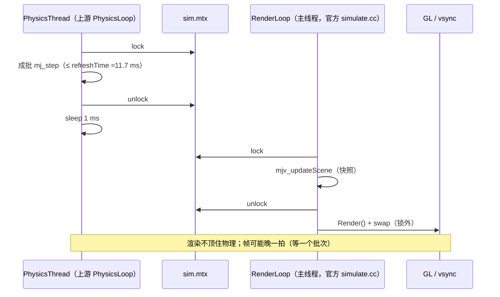

**② unitree_mujoco Python**（唯一一个「渲染顶住物理」的）：

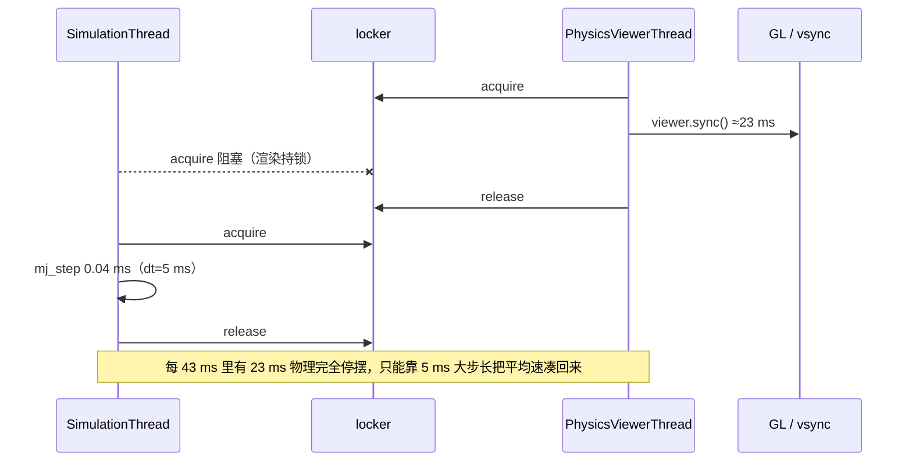

**③ 我们 C++（官方 `Simulate`，`cpp_task2 --mode view`）**：

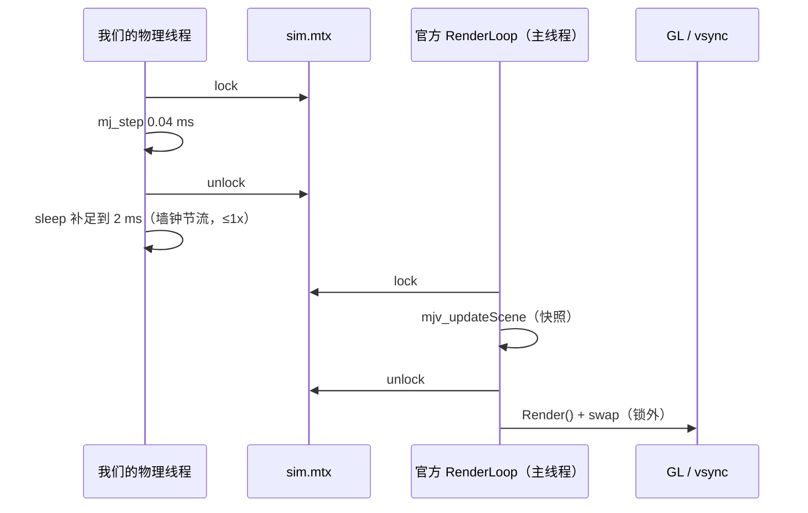

**④ 我们 Python（`python/` 双缓冲）**：

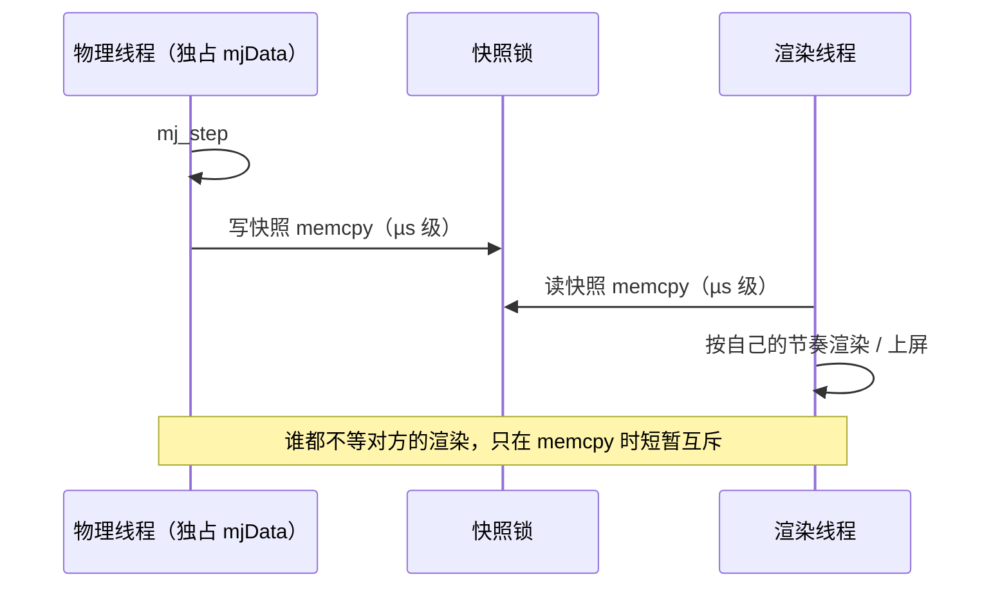

**⑤ 我们 Python baseline（`scripts/simulate.py` 单线程）**：

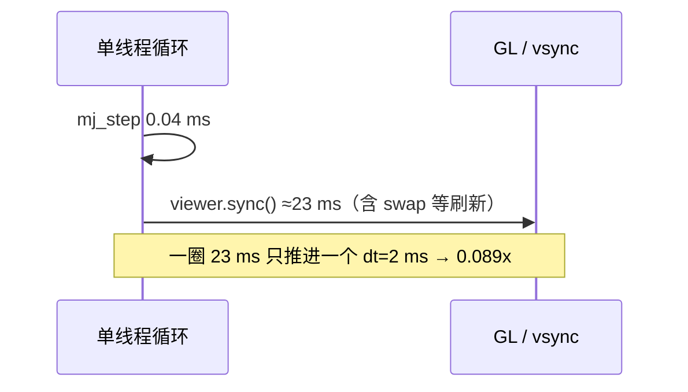

### 11.3 结论：哪种改法真的提高了性能

- **⑤ → ④ 是唯一一次量级提升**（0.089x → 0.998x）：把渲染移出物理线程，锁只罩快照。物理结果与单线程裸循环逐位相同（[`physics_pacing.py`](../../@20260923_mujoco/scripts/agent_scripts/physics_pacing.py) 用例 0 校验），所以这是纯收益。
- **④ → ③ 再上一层**（0.998x → 1.00x）：C++ 没有 GIL，而且官方界面的 `RenderLoop` 本来就是「锁只罩快照、渲染在锁外」——**这一步的非阻塞是白拿的**，我们只写了物理线程与节流。
- **① 与 ③ 结构同源**（同一份 `simulate.cc`）：差别是 ① 多了 SDK 桥、手柄、虚拟挂带；但 ① 的桥里**没有快照式控制通道**——桥线程直接写 `d->ctrl`（它拿的是 `lowcmd` 自己的锁，不是 `sim.mtx`），那是竞态，不是速度问题（见 [`unitree-mujoco.md`](unitree-mujoco.md) §7 问题 1）。
- **② 是唯一「渲染顶住物理」的方案**，⑤ 是它在单线程下的极限版。想在 ② 上拿到 1x，必须缩短渲染占锁时间：降频 `viewer.sync()`、或 ④ 那样的双缓冲——**这就是任务 3 的动机**，不是「物理太慢」。
- 反过来说，**③ 已经站在「结构已最优 + 1x 到顶」的位置**（按墙钟 1x 就是上限，再快没有意义）；任务 4 若继续做，价值在「自己实现一遍」和「不依赖官方 UI 的路径」，不在性能。

### 11.4 复核方法

| 数字 | 怎么复现 |
|---|---|
| `mj_step` 0.0432 ms/步，⑤ 的 23.1 ms/圈与 0.089x | 一次性探针：`mj_step` 2000 次计时 + `launch_passive` 下 50 圈 `step+sync` 计时（本机 i5-1035G1、960×540、`MUJOCO_GL=glfw`） |
| ② 的 0.542x、④ 的 0.998x | `pixi run python @20260923_mujoco/scripts/agent_scripts/physics_pacing.py`（用例 2/3，渲染开销设 20 ms） |
| ③ 的 1.00x | `pixi run @20260923_mujoco/cpp_task2/build/dog_sim <scene> 1 --mode view`，看它打印的 `wall` |
| ① 的锁范围 | 上游 `simulate/src/main.cc`：`PhysicsLoop` 的 `sim.mtx` 包住 step 批次；官方 `simulate.cc`：`RenderLoop` 里 `// MutexLock (unblocks simulation thread)` |
| ② 的锁范围 | 上游 `simulate_python/unitree_mujoco.py:69-75`（`locker.acquire(); viewer.sync(); locker.release()`）与 `:37-67`（`locker` 包住 `mj_step`）、`config.py:13`（`SIMULATE_DT` 的注释） |

> ① ② 的源码核对时间为 2026-09-26，直接查上游 GitHub 仓库（本机 `Replicate.d` 下那份复现副本已删）。

## 12. 与笔记的分工

| 内容 | 位置 |
|---|---|
| 三条业务主干、结论清单、API 差异、问题清单、目标设计 | [`unitree-mujoco.md`](unitree-mujoco.md) |
| 进程/线程全展开（本文件 §1、§3、§4）、消息与 DDS 接口（§2）、启动/稳态/退出时序（§5-§7）、SDK 先例（§9）、待核实清单（§10）、五种方案的每帧阻滞对比（§11） | 本文 |
