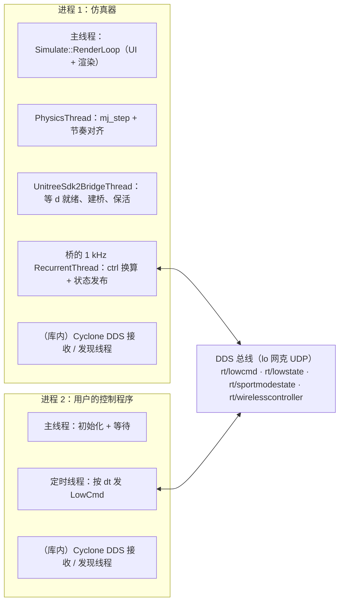
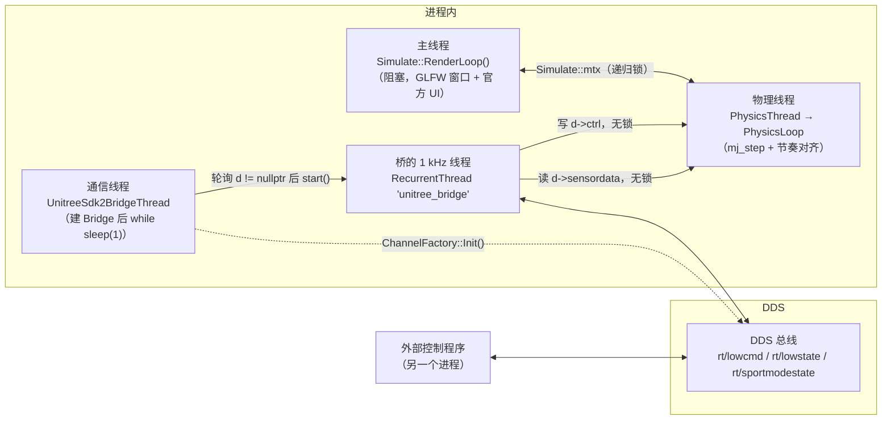
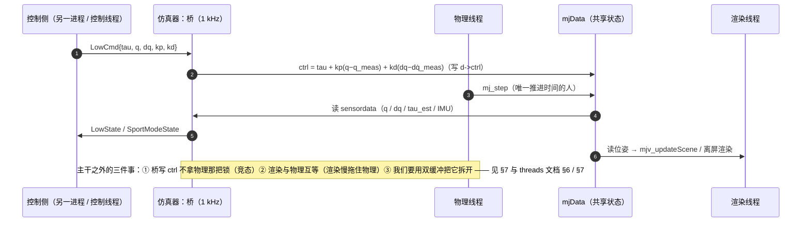
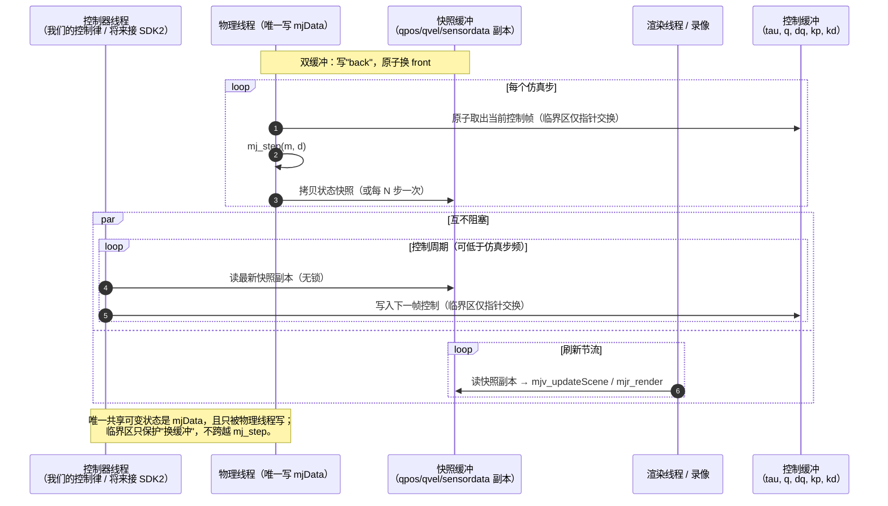

# unitree_mujoco 研读笔记

研读对象是 `unitreerobotics/unitree_mujoco`（本工作区克隆在 `ReadOnly.d/unitree_mujoco`，commit `1eb6642`，BSD-3-Clause）。目的是给任务 3（结构与线程设计）提供参考、给任务 4（C++ 重做）定结构，并明确**哪些抄、哪些不抄**。文中引用格式为 `文件:行`，文件路径相对该克隆目录。

> 相关文档：MuJoCo 本体知识见 [`mujoco.md`](mujoco.md)，图形栈见 [`graphics-stack.md`](graphics-stack.md)，图形后端与开销实测见 [`mujoco.md` 第 7 节](mujoco.md#7-渲染后端mujoco_gl与开销)。 任务背景与目标结构（这些笔记要服务的对象）见 [`../../@20260923_mujoco/README.md`](../../@20260923_mujoco/README.md)。 文档索引见 [`../../README.md`](../../README.md)。

## 0. 预备知识（线程 / 进程 / DDS）

后面讲的“线程间通信”和 unitree 用的“进程间通信”是两个层次的东西，先把概念分清再看代码。

### 0.1 进程与线程：对内共享，对外隔离

| 维度 | 进程（process） | 线程（thread） |
|---|---|---|
| 地址空间 | 各自独立（各自一套页表） | **共享**同一进程的堆、全局变量、静态变量 |
| 私有部分 | 全部 | 只有栈、寄存器、线程局部存储（TLS） |
| 通信方式 | 必须走 IPC：管道 / unix socket / 共享内存 / TCP / DDS … | 直接读写同一块内存，因此**必须自己加锁** |
| 创建与切换成本 | 高（页表、fd 表、内核对象） | 低（只换栈与寄存器） |
| 故障隔离 | 一个进程崩了，别的进程不受影响 | 一个线程段错误 → **整个进程**一起死 |
| 调试 | 可以单独 attach、单独重启 | 共享状态，竞态难复现 |

一句话记法：**“对内”用线程（快，但同步要自己做），“对外”用进程（隔离好，但必须先定义协议）**。

### 0.2 什么时候用哪个（结合本项目的例子）

- **本项目（任务 3/4）选线程**：物理步进、渲染、录像、控制要**高频共享 `mjData`**（每步都要读位姿、写 `ctrl`）。用进程就得每步序列化一次状态，代价远大于同步开销；代价是自己设计同步 —— 我们的方案是“双缓冲 + 只保护指针交换”（见第 8 节）。
- **unitree_mujoco 两个边界都用，不要混为一谈**：**对外**是进程（仿真器 ↔ 控制程序，走 DDS，见 0.4），**对内**是线程（仿真器进程内共 4 个自建线程，见 0.5）。它的特色**不是“几个进程 / 几个线程”**，而是**把“控制程序”整个挪到另一个进程里，用 DDS 换成真实机器人那套通信** —— 代价是状态每步要序列化一次（`LowState` 跑 1 kHz），换来的是“同一套控制程序在仿真与实机上不用改”；崩溃隔离只是顺带的收益。
- **什么时候反而该用进程**：需要故障隔离；需要跨语言/跨机器；或者要并行跑多个**互不干扰**的仿真实例（每个进程一套 `mjData`，天然隔离）。
- **Python 里的额外事实**（本机实测）：`mj_step` 会释放 GIL，所以**多线程真的能并行推进物理** —— 两个线程各跑 20000 步耗时 1.09 / 1.12 s，与单线程的 0.99 s 接近（若被 GIL 串行，各自应接近 2 s），有效吞吐约 1.8×。前提是**各线程用自己的 `mjData`、只共享只读的 `MjModel`**；若要共享同一个 `mjData`，依旧必须加锁（这正是第 7 节的问题）。
- **C++ 侧没有 GIL**，线程并行更直接，但“共享可变状态要加锁”这条规则完全一样。

### 0.3 DDS 是什么

- 全称 **Data Distribution Service**（数据分发服务），是 **OMG**（Object Management Group）制定的**发布/订阅中间件标准**；它对应的线协议叫 **RTPS**（Real-Time Publish-Subscribe，也是 OMG 标准）。
- 核心模型：**按 topic 收发，没有中心 broker**（真正的点对点）。发布者只往 topic 上发，订阅者只订阅 topic，双方互不知道对方存在；消息类型用 **IDL** 描述，由代码生成器生成收发结构体。
- 内部主要做四件事：**发现**（SPDP/SEDP，通过 UDP 组播互相打招呼、交换 topic/类型/QoS）、**传输**（UDP 单播/组播，按 QoS 决定是否需要重传）、**QoS 管理**（reliable / best-effort、历史深度、deadline、liveliness…）、**序列化**（CDR/XCDR）。QoS 让同一套中间件既能传“尽力而为的传感器流”，也能传“必须送达的控制指令”。
- 常见实现：**Eclipse Cyclone DDS**、eProsima Fast DDS、RTI Connext。unitree 用的是 **Cyclone DDS**（证据：它的 readme 让你设 `CYCLONEDDS_HOME` 才能编译 `unitree_sdk2_python`）。
- **对本项目：用不到**。我们没有实物、也没有第二个进程；DDS 的价值在于“仿真与实机共用一套通信栈”，而我们要解决的是**单进程内的线程边界**。

### 0.4 unitree_mujoco 的进程间通信方案

- **DDS（Cyclone DDS）+ 回环网卡**：`simulate/config.yaml` 里 `domain_id: 1`、`interface: "lo"`（Python 版 `simulate_python/config.py` 同值），也就是仿真器与用户程序在**同一台机器**上通过 **loopback 的 UDP** 互换消息 —— 把 `lo` 换成 `eth0` 就变成跨机器，协议一行不用改。
- **消息**：下行 `rt/lowcmd`（`LowCmd`，每电机 `{tau, q, dq, kp, kd}`）；上行 `rt/lowstate`（`LowState`：电机 `q/dq/tau_est` + IMU）、`rt/sportmodestate`（机身位置/速度）；G1 另有 `rt/secondary_imu`、`rt/lf/bmsstate`。
- **连接方式**：`ChannelFactory::Instance()->Init(domain_id, interface)` 加入 DDS 域；桥为每类消息建 publisher / subscriber（`bridge.h` 里的 `LowCmd_t` / `LowState_t` 等），并**用 SDK 的 `RecurrentThread` 定时把仿真状态发出去**；下行则完全由订阅回调驱动（见 2.1 的“次要线程”）。
- 一句话：**对外是 DDS（跨进程），对内是“桥线程 + 物理线程共享 `mjData`”（同进程）**。第 7 节列的问题，全部出在“对内”这一半。

### 0.5 unitree_mujoco 的进程与线程全景

先破一个常见说法：它**不是“3 进程”也不是“3 线程”** —— 是 **2 个进程**，仿真器进程内是多线程；“3” 指的是**仿真器里的三条业务线**（物理 / UI / DDS 桥）。另有一类不算它设计的线程：**DDS 库内部**的接收与发现线程。

> 完整展开（每个进程的线程全清单、C++ 侧 publisher 自带的发布线程、Python 侧的 `ch_reader`、消息字段、启动/稳态/退出时序、SDK 的双缓冲先例）见 [`unitree-mujoco-threads.md`](unitree-mujoco-threads.md)。

| 版本 | 进程 | 该进程里的线程 | 证据 |
|---|---|---|---|
| C++ | `./unitree_mujoco`（仿真器） | ① 主线程 `Simulate::RenderLoop`；② `PhysicsThread`；③ `UnitreeSdk2BridgeThread`；④ 桥的 1 kHz `RecurrentThread`；⑤（库内）DDS 线程 | `main.cc:695`（③）、`:698`（②）、`:701`（①）、`bridge.h:170`（④） |
| C++ | `example/cpp/stand_go2.cpp`（控制程序） | ① 主线程；② `CreateRecurrentThreadEx("writebasiccmd", …, int(dt*1000000), …)` 定时发 `LowCmd`；③（库内）DDS 线程 | `example/cpp/stand_go2.cpp:98` |
| Python | `python3 unitree_mujoco.py`（仿真器） | ① 主线程（调 `launch_passive`，起完两个手写线程就结束）；② `launch_passive` **内部创建的 UI 守护线程**；③ `SimulationThread`（建 DDS 桥 + `mj_step`）；④ `PhysicsViewerThread`（`viewer.sync()`）；⑤ 桥的 3 个 `RecurrentThread`（lowstate / highstate / wireless）；⑥（库内）DDS 线程 | `mujoco/viewer.py:575`、`:586`（②）；`unitree_mujoco.py:38`（③）、`:70`（④）；`unitree_sdk2py_bridge.py:63`、`:71`、`:81`（⑤） |
| Python | `example/python/stand_go2.py`（控制程序） | 只有主线程：`while True` + `time.sleep` 自己节拍 | `:53`、`:86` |

两点值得记住：

- **“三线程”只是业务线，不是线程总数**：C++ 版自建线程实际 4 个（多出桥的定时线程），再加官方 `Simulate`、SDK、DDS 库内部的线程；Python 版因为桥用了 3 个定时器线程、又有 viewer 自带的 UI 线程，实际线程数比 C++ 还多。所以**重点不是线程数量，而是边界与同步方式**。
- **两个进程用的是同一套 `RecurrentThread` 抽象**（C++ 侧 `CreateRecurrentThreadEx`、Python 侧 `RecurrentThread(interval=…)`，单位分别是微秒与秒，见 2.3）。这是这套 SDK 的风格：**一切周期性的东西都做成“定时器 + 回调 + 自己的线程”**。

## 1. 它是什么

一句话：**把 Unitree 的实物通信协议（DDS + `unitree_sdk2`）接到 MuJoCo 上**，让用 SDK2 / ROS2 写的控制程序在仿真里跑，从而做 sim-to-real。它自己不提供控制算法。

| 目录 | 作用 | 与我们的关系 |
|---|---|---|
| `simulate/` | C++ 仿真器（`simulate/src/main.cc` 706 行） | **主要参考**：三线程结构 |
| `simulate_python/` | Python 仿真器（`unitree_mujoco.py` 83 行 + 桥 428 行） | 对照参考（线程模型更粗糙） |
| `unitree_robots/<robot>/` | 11 个机型的 MJCF（go2 / b2 / h1 / g1 / a2 / as2 / r1 / h2 …） | 只借组织方式，不用它的模型 |
| `terrain_tool/` | 地形（hfield）生成 | 与我们无关 |
| `example/` | 用户程序示例（`cpp/stand_go2.cpp`、`python/stand_go2.py`、`ros2/`） | 说明"控制程序是**另一个进程**" |
| `doc/func.png`、`readme*.md` | 架构图与文档 | 已读过 |

要点：控制程序与仿真器**是两个进程**，中间只走 DDS 消息（`LowCmd` 下行、`LowState` / `SportModeState` 上行）。这解释了它为什么需要那么多跨线程通信——那套通信在我们这里大部分是不需要的。
### 1.1 C++ 版与 Python 版：同源但不等价

常见误解是“两个目录只是同一实现的两种语言”。实际是：**“对外”的桥（DDS 协议层）两边同源、几乎一一对应；“对内”的仿真器主体完全不等价** —— C++ 是完整仿真器（靠 MuJoCo 官方 `Simulate`），Python 是最小可跑版。

规模差异：C++ 侧 `main.cc` 706 + `param.h` 120 + `unitree_sdk2_bridge.h` 323 + `physics_joystick.h` 89 = **1238 行**（`simulate/src/`）；Python 侧 `unitree_mujoco.py` 83 + `unitree_sdk2py_bridge.py` 428 + `config.py` 14 = **525 行**（`simulate_python/`）。

| 能力 | C++（`simulate/`） | Python（`simulate_python/`） |
|---|---|---|
| DDS 桥（`LowCmd` 订阅、`LowState`/`SportModeState` 发布、PD 换算） | 有 | 有（几乎一一对应） |
| `WirelessController` 话题（手柄） | 有（`bridge.h:155`，可选） | 有（`:28`，可选） |
| G1 额外话题（`rt/lf/bmsstate`、`rt/secondary_imu`） | 有（`bridge.h:272`、`:275`） | 无 |
| 界面（拖拽/菜单/滑块/热重载） | 有，靠官方 `Simulate`（`droploadrequest`/`uiloadrequest`） | 无，只有 `launch_passive` |
| 实时对齐算法（`syncMisalign`/`simRefreshFraction`） | 有 | 无（改用“单步睡够差额”） |
| 控制噪声注入、状态历史 | 有（`ctrl_noise`、`AddToHistory`） | 无 |
| 插件扫描、自定义键盘回调 | 有（`scanPluginLibraries`、`user_key_cb`） | 无 |
| CLI 参数（`-r` 选机器人、`-s` 选场景）、YAML 配置 | 有（`param::helper` + `config.yaml`） | 无（改 `config.py` 源码） |
| elastic band（调试川） | 有 | 有（自己的 `ElasticBand` + 键盘回调） |
| 时间步 | 不设，用 XML/默认 **0.002 s（500 Hz）** | 强制改为 `SIMULATE_DT` = **0.005 s（200 Hz）** |

**一个容易踩的行为差异：两版的时间步不同**。C++ 的 `config.yaml` 里根本没有 `timestep` 项（go2 场景也没写），所以用 MuJoCo 默认的 0.002 s；Python 则把模型 timestep 改成 `config.SIMULATE_DT = 0.005`（`unitree_mujoco.py:31`）。所以**两版跑出来的数字不能直接对比** —— 同步长不同。

**关于 joystick（回答“它们是否只是附属输入组件”）**：是的，它是**附属输入组件、也是硬件替身**，不参与物理或仿真循环的关键路径。真机上的遥控器是无线手柄，仿真里没有这个硬件，于是用手柄顶替：C++ 侧是 `physics_joystick.h` 里的 `XBoxJoystick` / `SwitchJoystick`（读 `/dev/input/js0`，`physics_joystick.h:9`、`:12`、`:51`），Python 侧是 pygame 的 `SetupJoystick(device_id=0, js_type="xbox")`（`unitree_mujoco.py:45`、`unitree_sdk2py_bridge.py:295`）；两者都把它填进 `rt/wirelesscontroller` 话题发出去，让控制程序在仿真里能拿到**与真机同样的遥控输入**（C++ 在 1 kHz 循环里 `lowstate->joystick->update()`，`bridge.h:177`；Python 单独一个 100 Hz 发布线程，`unitree_sdk2py_bridge.py:82`）。两边默认状态还不一样：C++ 的 `use_joystick: 0`（关）、Python 的 `USE_JOYSTICK = 1`（开）。
## 2. 三线程架构

严格说，这里是**仿真器里的三条业务线**（物理 / UI / DDS 桥），不是线程总数 —— C++ 版自建线程实际有 4 个，Python 版更多，全景见 0.5。

### 2.1 先认人：各线程的自我介绍

先看一句话版本的“我是谁”，再看图就不会迷失：

| 线程 | 一句话自我介绍（对其它线程说） |
|---|---|
| 物理线程 `PhysicsThread` / `PhysicsLoop` | “时间由我推进：写 `mjData` 的权限归我，我只在 `sim.mtx` 里干活。” |
| 主线程 `Simulate::RenderLoop()` | “我只负责画和收键鼠；每次刷新我都抢 `sim.mtx`，抢到就快速看完走人。” |
| 通信线程 `UnitreeSdk2BridgeThread` | “我只在启动时出现：等 `mjData` 就绪、建好 DDS 桥，然后就一直睡。” |
| 桥的 1 kHz 线程 `RecurrentThread` | “我每 1 ms 醒一次，把 DDS 指令换算成 `d->ctrl`、把 `d->sensordata` 打包发出去 —— 但我**不拿** `sim.mtx`。” |
| Cyclone DDS 接收线程（次要） | “别人发来的 `LowCmd` 由我收下并回调 `LowCmdHandler`，我跑在 DDS 自己的线程里。” |
| Python 版的 3 个 `RecurrentThread`（次要） | “我们按 `1/dt` 的节拍分别发 `LowState`、`SportModeState`、`WirelessController`。” |
| Python 版的 `PhysicsViewerThread`（次要） | “我只做一件事：拿 `locker` → `viewer.sync()` → 放锁 → 睡 `VIEWER_DT`。” |

**物理线程（`simulate/src/main.cc:327` 的 `PhysicsLoop`，入口在 `:538` 的 `PhysicsThread`）的三分钟自我介绍**

- 我拥有 `mjModel` / `mjData` 的**创建与销毁权**（`PhysicsThread` 里 `mj_loadXML` → `mj_makeData` → `sim->Load`）。
- 我负责推进时间：`mj_step` 只在 `main.cc:464`（重同步那一步）与 `:505`（追赶循环）被调用，且都在 `unique_lock(sim.mtx)` 里（`:413` 到 `:531` 之间）。
- 我还负责“软性交互”：elastic band 写 `d->xfrc_applied`（`:498-500`）、控制噪声写 `d->ctrl`、把每步状态压进 `sim` 的历史缓冲（`:519`）。
- 我的节奏是自算的：`syncMisalign=0.1`、`simRefreshFraction=0.7`（`:94-95`），落后或领先太多就重同步 —— 我**不睡觉等别人**，也不通知别人。
- 我最怕两件事：桥线程在我写 `d` 的时候也在写（见第 4 节）；以及界面上“打开新模型”（`sim.uiloadrequest`）让我 delete 掉 `d` 时，别人手里还攥着旧指针（delete 在 `:352-353` 与 `:382-383`）。
- 我出错的表现：画面突然跳到 4 m 高（穿模被弹飞），或者直接段错误。

**主线程 / `Simulate::RenderLoop()`（`simulate.h:86`）的三分钟自我介绍**

- 我是 `main` 里最后进入的那个阻塞循环（`main.cc:701`），窗口、菜单、键鼠都由我处理。
- 我不认识 DDS，也不认识 elastic band；我只认 `Simulate` 持有的那份 `mjModel` / `mjData` 和一把 `sim.mtx`。
- 我每次刷新：抢 `sim.mtx` → `mjv_updateScene`（读位姿、组装场景）→ `mjr_render` → 放锁。
- 我受显示刷新率节流，所以我持锁的时长 ≈ 一次渲染成本：本机实测单帧 5.5 ms（EGL→独显）到 20 ms（核显）不等 —— 这几十毫秒里，物理线程必须等我（这就是第 7 节问题 2）。
- 我和 GLFW 的关系：`Simulate` 通过抽象基类 `PlatformUIAdapter` 与我交互（`simulate.h:53-55`），`GlfwAdapter` 只是其中一个实现（见 2.3）。
- 我出错或被关闭时：整个进程结束 —— 有趣的是 C++ 版物理线程结尾还有个 `exit(0)`（`main.cc:570`）兜底。

**通信线程 `UnitreeSdk2BridgeThread`（`main.cc:573-617`）的三分钟自我介绍**

- 我的一生只有三件事：**等** `d` 就绪（每 0.5 s 轮询一次，`:583`）、`ChannelFactory::Init(domain_id, interface)` 加入 DDS 域、按机器人选 IDL 并构造 `Go2Bridge` / `G1Bridge`（`:598-609`）。
- 建完桥我就没用了，于是 `while(true) sleep(1)` 挂着（`:613-615`）—— 纯粹为了不让线程退出。
- 我不知道控制律，也不碰 `mjData`；`mjModel` / `mjData` 的裸指针我只是**转发**给桥。
- 我的隐患：如果模型被换成另一套（`m`、`d` 被 delete 再 new），我转发出去的是旧指针，桥不知道。

**桥的 1 kHz 线程（`simulate/src/unitree_sdk2_bridge.h:170-245`）的三分钟自我介绍**

- 我每 1 ms 醒一次（`RecurrentThread("unitree_bridge", UT_CPU_ID_NONE, 1000, run)`，`1000` 的单位是**微秒**，见 2.3）。
- 上半场（写控制）：拿 `lowcmd->mutex_` 读到最新指令，按 `tau + kp*(q - q_meas) + kd*(dq - dq̇_meas)` 算出力矩，**直接写 `mj_data_->ctrl[i]`**（`:180-185`）。
- 下半场（发状态）：`trylock()` 成功才把 `d->sensordata` 里的电机 `q/dq/tau_est`、IMU 四元数（顺便算出 rpy）、机身位置速度打包进 `LowState` / `SportModeState`，`unlockAndPublish()` 发出去（`:190-245`），时间戳用 `round(d->time / 1e-3)`。
- 我唯一持有的锁是**消息自己的锁**：`lowcmd->mutex_` 保护“我读消息”，`trylock` 保护“我写消息” —— 两把锁都**不保护 `mjData`**，这是第 7 节问题 1 的全部原因。
- 我长得像“控制回路”，其实只是**协议适配层**：真正的控制律在另一个进程里。

### 2.2 架构图与共享对象

C++ 版的线程分工与共享对象（`simulate/src/main.cc:573-617`、`simulate/src/unitree_sdk2_bridge.h:170`）：

三个关键事实：

1. **共享的只有一个裸 `mjData*`（`m`、`d` 是文件级全局变量）**，没有任何所有权封装；唯一一把大锁是 `Simulate::mtx`（`simulate.h:41` `class SimulateMutex : public std::recursive_mutex {}`、`:179` `SimulateMutex mtx`），而**桥的 1 kHz 线程完全不碰这把锁**。
2. 桥线程自己只有一把**消息级**小锁（`unitree_sdk2_bridge.h:180` `lock_guard<std::mutex> lock(lowcmd->mutex_)`，保护的是收到的 `LowCmd` 消息），它**不保护** `mj_data_`。
3. 物理线程在 `main.cc:413` 用 `unique_lock<std::recursive_mutex> lock(sim.mtx)` **包住整个 step 循环**（含 elastic band、噪声注入、`AddToHistory()`），一直到 `main.cc:531` 才释放。

### 2.3 几个名字的来历（1 kHz / `Simulate` / `sim.mtx`）

**“桥的 1 kHz 循环”**：`RecurrentThread("unitree_bridge", UT_CPU_ID_NONE, 1000, run)`（`bridge.h:170-171`）。SDK 的第三个形参名就是 **`intervalMicrosec`**（unitree_sdk2 的 `include/unitree/common/thread/recurrent_thread.hpp`），所以 `1000` = 1000 µs = 1 ms ⇒ **1 kHz**；传 `0` 表示“不限速、跑满”（该实现会走 `ThreadFunc_0` 忙循环）。`UT_CPU_ID_NONE` 表示不綁 CPU 亲和性。**注意 Python 版同名类的 `interval` 单位是「秒」**（`unitree_sdk2py.utils.thread.RecurrentThread(interval=1.0)`，内部用 `timerfd(CLOCK_MONOTONIC)` 定时、线程是 `daemon=True`），所以 `simulate_python` 里 `interval=self.dt` = `config.SIMULATE_DT` = 0.005 s ⇒ **200 Hz**（Python 版还会把模型 timestep 也改成这个值，见 1.1），而不是 1 kHz —— 两侧单位不一致，很容易看错。

**`Simulate` 是谁引入的**：它是 **MuJoCo 官方示例**（MuJoCo 仓库的 `simulate/` 目录）里的“UI + 渲染循环”类，既不是 GLFW 的一部分，也不属于 `unitree_mujoco`。它声明在 `include/simulate/simulate.h`、实现在 conda 包提供的 `libsimulate.so`（CMake 目标 `mujoco::libmujoco_simulate`）。它**不直接依赖 GLFW**：构造参数是抽象基类 `std::unique_ptr<PlatformUIAdapter>`（`simulate.h:53-55`），GLFW 只是其中一个实现（`GlfwAdapter`，另有 macOS 的 `glfw_corevideo`）。所以时序图里的 participant 应该写成 `Simulate（官方 UI，内部用 GLFW）`，而 GLFW 只是它内部的窗口 / GL context 实现细节。对我们的意义：**界面这条线是可选的** —— 我们的程序只依赖 `mujoco::mujoco`，要 UI 时才额外链上 `libmujoco_simulate`。

**`sim.mtx`**：`Simulate` 内部的递归锁（`simulate.h:41` `class SimulateMutex : public std::recursive_mutex {}`，`:179` `SimulateMutex mtx`）。“递归”意味着同一线程可以重复加锁 —— 所以物理线程在持锁期间再调 `Simulate` 的方法（如 `AddToHistory`）不会自锁。

## 3. 启动握手（主干）

启动顺序的要害只有一句：**先建模型、再建桥**。unitree 用“轮询全局指针 + `usleep(500000)`”来对齐这个顺序（`main.cc:576-583`），建完桥后用 `while(true) sleep(1)` 保活（`main.cc:613-615`）；Python 版则用固定 `time.sleep(0.2)` 赌 viewer 先起来（`unitree_mujoco.py:35`）。

这里能看出两个结构问题：**用轮询 + 睡眠同步启动顺序**（而不是条件变量或事件），以及**保活线程什么都不做却常驻**。反过来，`RecurrentThread` 那种“给周期 + 回调”的抽象很省事，值得学。

逐步时序图（C++ / Python 各一张）见 [`unitree-mujoco-threads.md`](unitree-mujoco-threads.md) §5。

## 4. 稳态一步：主干数据流

稳态就一件事：**控制侧 → 桥换算成力矩 → 物理步进 → 渲染/通信读取**。主干如下：

对照 Python 版更直白：`simulate_python/unitree_mujoco.py:52-61` 用一把全局 `locker` 包住 `mj_step`，`:72-74` 又用同一把锁包住 `viewer.sync()`；而 DDS 回调 `LowCmdHandler`（`unitree_sdk2py_bridge.py:111-123`）直接写 `self.mj_data.ctrl[i]`，**从头到尾没拿到那把 `locker`**。

### 4.1 这张图的箭头该怎么读（哪些是异步、哪些会阻塞）

时序图默认“每条箭头都是一次通信”，但通信语义差别很大。逐类说明，带 ⚠️ 的是我第一版画得太简、现已改正的地方：

| 箭头 | 真实语义 | 有去有回？ |
|---|---|---|
| `std::thread(f, ...)` | 只创建线程就返回，不等它开始跑 | 有去无回（对） |
| DDS `publish(topic)` | 投递到总线即返回；不等订阅者、无确认（“一箭多发”，可能 0 个也可能 n 个订阅者） | 有去无回（对，这正是 DDS 解耦的价值） |
| DDS 订阅回调（`LowCmdHandler` / `LowCmd_t` 的回调） | 由 **Cyclone DDS 的接收线程**异步调用；发布者不知道、也不等 | 有去无回（对） |
| `lock(...)`（`sim.mtx` 或 `lowcmd->mutex_`） | **可能阻塞**：要等持有者释放 | ⚠️ **有去有回（会等）**，第一版画成了一去不返 |
| `trylock()` | 只尝试一次，失败就跳过整段 | 有去无回（对），但要注意“失败 = 这一轮状态不发布” |
| `sim->Load(...)`、`mj_deleteData/Model` | 同步调用，返回时已生效（且与渲染线程共享同一份 `Simulate` 状态） | ⚠️ 有去有回，第一版画成了一去不返 |
| `unlockAndPublish()` | 解锁 + 交给 DDS 发送，不等送达 | 有去无回（对） |
| `usleep` / `sleep` / `join` / `exit(0)` | 纯粹的等待或终止，不是“通信” | 无通信含义（`join` / `exit` 其实是同步点） |

一句话总结：**DDS 那条线天生是异步单向的（发了就不管，谁收到算谁的）；而“锁”那条线一定是同步双向的（抢不到就得等）**。稳态图已经把这层区别标进去了：桥写 `d->ctrl` 一路**不等任何人**（所以它有竞态），而物理线程与渲染线程之间是**会互等**的（所以渲染慢会拖住物理）。

## 5. 通信与同步 API 清单

| 动作 | API / 原语 | 线程 | 同步方式 | 位置 |
|---|---|---|---|---|
| 建模型/数据 | `mj_loadXML` / `mj_makeData` / `mj_forward` | 物理线程 | 写全局 `m`、`d`，无同步 | `main.cc:538-570` |
| 步进 | `mj_step` | 物理线程 | `unique_lock(sim.mtx)` 包整个循环 | `main.cc:413,464,505` |
| 节奏对齐 | `elapsedCPU` / `syncMisalign=0.1` / `simRefreshFraction=0.7` | 物理线程 | 自算，不阻塞他人 | `main.cc:94-95,452,474` |
| 手动拖拽/换模型 | `sim.Load` / `droploadrequest` / `uiloadrequest` | 物理线程 | 在 `sim.mtx` 内 delete/create `m`、`d` | `main.cc:339-390` |
| 控制量换算 | `d->ctrl[i] = tau + kp*(q-q_meas) + kd*(dq-dq_meas)` | 桥 1 kHz | 仅 `lowcmd->mutex_` | `bridge.h:180-185` |
| 状态采样 | 读 `d->sensordata[...]` | 桥 1 kHz | 仅 publisher 自己的 `trylock()` | `bridge.h:190-245` |
| 传感器寻址 | `mj_name2id(m, mjOBJ_SENSOR, "imu_quat")` + `model->sensor_adr[]` | 构造期 | 无 | `bridge.h:81-129` |
| 上扶一把 | `d->xfrc_applied[6*body_id + k]` | 物理线程 | 在 `sim.mtx` 内 | `main.cc:498-500` |
| 时间戳 | `tick = round(d->time / 1e-3)` | 桥 1 kHz | 无 | `bridge.h:225` |
| 渲染 | `Simulate::RenderLoop`（内部 `mjv_updateScene` + `mjr_render`） | 主线程 | 同一把 `sim.mtx` | `simulate.h:179` |

## 6. 值得借鉴的五件事

1. **控制语义与物理语义的解耦**：外部发的是 `{tau, q, dq, kp, kd}`，桥在这一层做 PD 换算写进 `d->ctrl`，物理侧永远是纯力矩。这样**上层用位置模式写的程序可以跑在力矩模式的模型上** —— 我们的 12 个 actuator 也是力矩模式，这层换算对我们直接适用。
2. **通信时间戳用仿真时间**（`round(d->time / 1e-3)`），不是墙钟。录像、回放、和实物的 tick 对齐都靠这个。
3. **传感器按名字查地址**（`mj_name2id` + `sensor_adr`），模型换名/换机型时不用改代码。
4. **一个 `RecurrentThread(周期, 回调)` 抽象**把"定时做某件事"从主循环里摘出来，简单有效（我们 Python 侧可以用 `threading.Timer`/自算 deadline 达到同样效果，C++ 侧用 `std::thread` + `condition_variable::wait_until`）。
5. **场景按 `<robot>/<scene>.xml` 组织**，scene 里 `include` 机器人本体；同一个模型可以配平地/地形/带 QRC 码的多个 scene。我们的 `models/` + `scenes/` 已经是这个思路。

## 7. 问题清单（也就是我们要改的地方）

| # | 问题 | 证据 | 后果 | 我们的做法 |
|---|---|---|---|---|
| 1 | 桥线程读写 `mjData` **不拿** `sim.mtx` | `bridge.h:180-194`（只锁 `lowcmd->mutex_`）；Python 版同样（`unitree_sdk2py_bridge.py:111-123` 没拿 `locker`） | 数据竞争：`ctrl` 可能被改在一步中间，`sensordata`/`qpos` 可能读到撕裂快照；MuJoCo 不保证外部并发访问 `mjData` 安全（`mujoco.h` 的 Threads 段只提供**求解器内部**线程池 `mju_threadpool`） | 物理线程独占 `mjData` 写权限；控制输入走**双缓冲**，临界区只做指针交换 |
| 2 | 渲染与物理共用一把大锁，锁跨越整个 `mj_step` 循环 | `main.cc:413` → `:531`；Python 版 `viewer.sync()` 与 `mj_step` 同锁（`unitree_mujoco.py:52-61` / `:72-74`）；**上游自己的注释也承认了这点**：`config.py:13` `SIMULATE_DT = 0.005  # Need to be larger than the runtime of viewer.sync()` | 渲染（本机实测 7.7~20 ms/次）持锁期间物理停摆，实时性抖动；Python 版只能把物理放慢到 200 Hz 来迁就它 | 物理线程写“状态快照”缓冲；渲染只读快照副本，不阻塞步进 |
| 3 | 用轮询 + `usleep` 等启动顺序，保活线程空转 | `main.cc:576-583`（`while(true)` + `usleep(500000)`）、`:613-615`（`while(true) sleep(1)`） | 启动慢半拍、多一个无用线程、无法优雅退出 | 条件变量/`std::promise` 做启动握手；用原子 `running` 标志 + `join()` 退出，不用保活线程 |
| 4 | 换模型时 `mj_deleteData/Model` 而其他人仍持裸指针 | `main.cc:352-353` / `:382-383`（`mj_deleteData(d); mj_deleteModel(m);`） | 悬垂指针；桥线程下一次 tick 就可能访问已释放内存 | `Simulator` 类持有所有权；换模型时先停线程 → 交换 → 再启动，或整体重建实例 |
| 5 | 退出靠 `exit(0)` 强制结束 | `main.cc:570`（`PhysicsThread` 末尾） | 析构不走、无法库化/测试、日志与录像可能截断 | 原子停止标志 + `join()`；录像 `close()` 显式收尾（现有 `VideoRecorder` 已是这个模式） |
| 6 | 全局裸 `mjModel*/mjData*`，没有对象边界 | `main.cc:99-100` | 谁都能改，依赖关系靠人记 | 一切状态收进 `Simulator`，对外只暴露 `step()`、`snapshot()`、`set_control()` |
| 7 | 用 `#define private public` 掏 `GlfwAdapter::window_` 拿窗口句柄，再 `glfwSetKeyCallback` **覆盖**掉 adapter 自己注册的按键回调 | `main.cc:15-18`（掏私有成员）、`main.cc:700`（覆盖回调）、`glfw_adapter.cc:77`（被覆盖的那个） | 依赖实现细节，版本一升就可能编译失败；而且 **GLFW 的 `glfwSetKeyCallback` 是单槽 setter**，覆盖后窗口按键事件不再进 `mjuiState`，官方 Simulate 的内置快捷键（Space 播放/暂停、`[`/`]` 换相机、F1~F5、方向键单步……清单见官方 `simulate.cc:133-179`）**应当全部失效**；鼠标交互与 Alt/Ctrl/Shift 相机修饰键不受影响（后者是 `glfwGetKey` 轮询，`glfw_adapter.cc:220-231`） | **不抄**。官方 3.12 的 `simulate.h` 里**没有**用户按键回调（grep `user_key_callback` / `key_callback` 均为空），这就是上游硬改 GLFW 的原因；我们自写渲染循环处理键盘 |
| 8 | 实时性用单步 `sleep(timestep - elapsed)`，无追赶 | `unitree_mujoco.py:63-67` | 睡眠抖动（几十~上百 µs）直接进时间轴，落后了不会补 | deadline pacing（`target = start + n*timestep`）+ 可选 `realtime / fast` 两种模式；落后超阈值时重同步（借 `syncMisalign` 的思路） |
| 9 | **控制器完全没有 stdin 控制**：`stand_go2` 只 `std::cin.get()` 等一次回车，之后跑固定脚本（站起 3 s → 趴下），无任何后续输入解析 | 全仓仅两处 stdin，都是等一次回车：`example/cpp/stand_go2.cpp:172`、`example/ros2/src/stand_go2.cpp:95` | 想在终端里“手动驾驶”没有现成入口。唯一的交互式输入是手柄（`use_joystick: 1` + `/dev/input/js*`；`physics_joystick.h:9`、`:51` 包成 `XBoxJoystick`/`SwitchJoystick`，由 `unitree_sdk2_bridge.h:243` 广播到 `rt/wirelesscontroller`），而默认配置 `use_joystick: 0` 是关的 | 自己加：stdin/键盘 → 控制缓冲区（或直接组一条模拟手柄消息），作为“三运行模式”里的一种；真正的控制接口本来就是 DDS 的 `rt/lowcmd` |

## 8. 我们的目标设计

同一份设计同时适用于 Python（任务 3 重构）与 C++（任务 4 复刻）：**一个拥有者 + 三个通信方向的双缓冲**，没有一把大锁跨越 `mj_step`。

职责边界（实现时照这张表写，越界的代码就是 bug）：

| 线程 | 拥有 | 可读 | 可写 | 同步 |
|---|---|---|---|---|
| 物理 | `mjModel` / `mjData` | 全部 | `mjData`（含 `ctrl`、`xfrc_applied`） | 控制缓冲取帧、快照缓冲写回（各一次短临界区） |
| 控制 | 自己的状态（增益、积分项、策略） | 快照缓冲 | 控制缓冲 | 短临界区 |
| 渲染 / 录像 | GL context、ffmpeg 管道 | 快照缓冲 | 无 | 无（读副本） |
| 通信（将来接 SDK2 / ROS2） | 消息队列 | 快照缓冲 | 控制缓冲 | 与"控制"同一接口 |

三个运行模式（沿用现有脚本的分工，Python 先做、C++ 跟上）：`--viewer`（被动界面，`sync()` 降频）、`--headless --record`（离屏渲染 + ffmpeg，按 `data.time` 节流）、`--headless`（尽量快跑完，用于回归与对照）。

**Python 侧的一个现成便利**：被动 viewer 的 Handle 自带官方锁与同步方法（`mujoco/viewer.py:227` 的 `lock()`、`:233` 的 `sync()`），可以直接 `with viewer.lock(): mj_step(...)`，不必像 unitree 那样自造一把全局 `locker`。但要清楚它的**作用范围**：它只保证"渲染不会读到写了一半的 `mjData`"，**不解决**"控制写入 ↔ 步进"这一对（那是我们自己要设计的双缓冲）。另外若同时要录像与开窗口，注意两者会争同一个 GL context（现有 `example_with_viewer.py` 已按"先建 viewer 再建 recorder"处理）。

## 9. API 与版本差异（它用 3.3.6，我们用 3.12.0）

它的 readme 让你把官方包解压到 `~/.mujoco` 再 `ln -s`（`readme_zh.md:62` 附近）；我们用 conda-forge 的 `mujoco` 包，**已经把界面库一起装好**（`mujoco::libmujoco_simulate` + `include/simulate/*.h`），所以那套步骤可以跳过。结构上可以放心照抄的部分与要小心的部分：

| 项目 | 3.3.6（它） | 3.12.0（我们） | 结论 |
|---|---|---|---|
| `Simulate` 所在命名空间 | `::mujoco::Simulate`（它写 `mj::Simulate`） | 同样是 `namespace mujoco { class Simulate }` | 兼容 |
| `array_safety` 的 `strcpy_arr` | `::mujoco::sample_util` | `::mujoco::sample_util` 仍在（`include/simulate/array_safety.h`） | 兼容 |
| 界面库 | 自己编官方 `simulate` 源码 | 现成 `libsimulate.so`（CMake 目标 `mujoco::libmujoco_simulate`） | 我们更省事 |
| `Simulate` 的构造签名与成员名（`run`/`busywait`/`mtx`/`speed_changed`/`percentRealTime`/`AddToHistory`…） | 3.3.6 的字段 | 以本地 `include/simulate/simulate.h` 为准逐项核对 | **有漂移风险**：这些是示例内部字段，不是稳定 API |
| 掏私有成员的 hack | `#define private public` | —— | **明确不抄** |
| 起步依赖 | `unitree_sdk2` + `libyaml-cpp` + `spdlog` + `boost` + `glfw` | 只需要 pixi 里的 `mujoco` + `glfw` + C++ 工具链 | 我们不做 DDS，依赖面小得多 |

原则：**只把 `Simulate` 当"可选的被动界面"用**（调 `Load` / `RenderLoop`），其余逻辑全在我们自己的类里；这样即便将来 MuJoCo 升级动了示例字段，也只影响界面那条支线。

## 10. 查阅入口

- C++：`simulate/src/main.cc`（物理循环 `:~340-540`、桥线程与 `main` `:~560-700`）、`simulate/src/unitree_sdk2_bridge.h`（桥全部逻辑）、`simulate/src/param.h`（配置项与 IDL 选择）、`simulate/config.yaml`。
- Python：`simulate_python/unitree_mujoco.py`（三个线程与锁）、`simulate_python/unitree_sdk2py_bridge.py`（`LowCmdHandler` 在 `:111-123`）、`simulate_python/config.py`。
- 官方界面库：`$CONDA_PREFIX/include/simulate/simulate.h`（`Simulate` 的公开成员）、`libsimulate.so`。
- MuJoCo 自己的线程观：`$CONDA_PREFIX/include/mujoco/mujoco.h` 的 `Threads` 段（只有 `mju_threadpool(d, nthread)`）、`mjdata.h:112-114`（`threadpool` / `threadlock` 字段）。

## 11. 本仓库的落点

上面这些设计与「要改的地方」落到我们自己的代码上（任务 3 的 Python 侧重构 + 任务 4 的 C++ 复刻，推进顺序见 [`../../@20260923_mujoco/README.md`](../../@20260923_mujoco/README.md)）：

- `../../@20260923_mujoco/cpp/src/main.cpp`：C++ 程序，头部注释就引用了本文；当前完成到工具链 + 模型加载 + 零力矩静止判定。
- `../../@20260923_mujoco/scripts/simulate.py` / `simulate_record.py`：Python 侧的最小仿真循环与录像。
