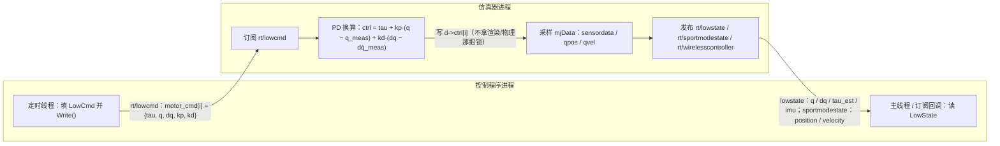
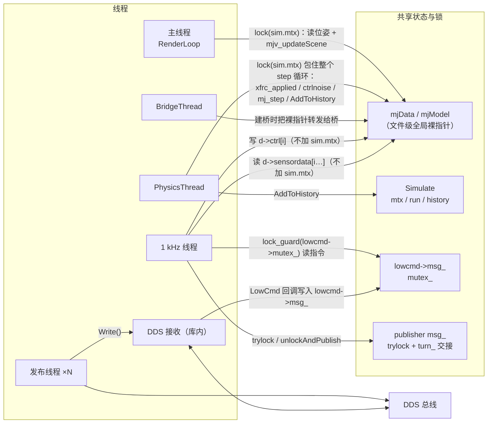
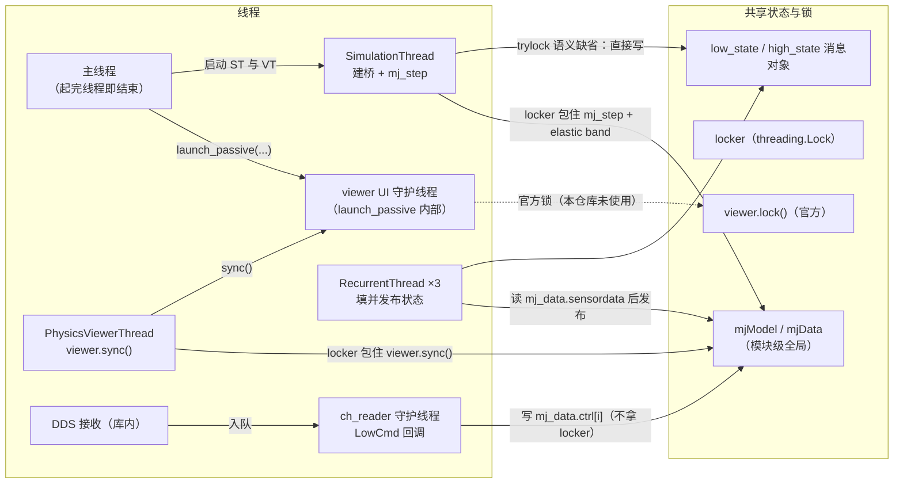
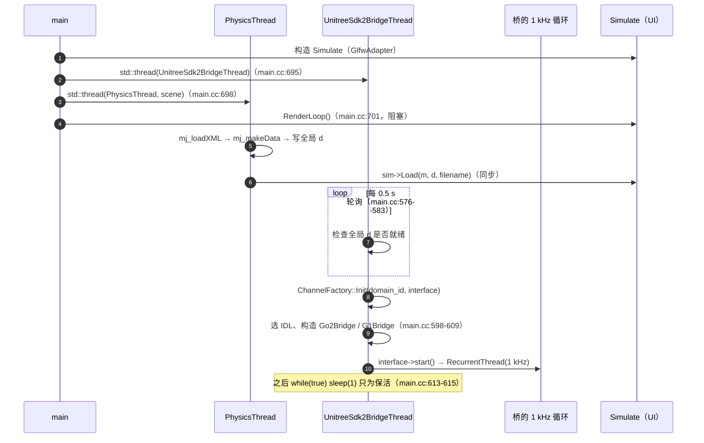
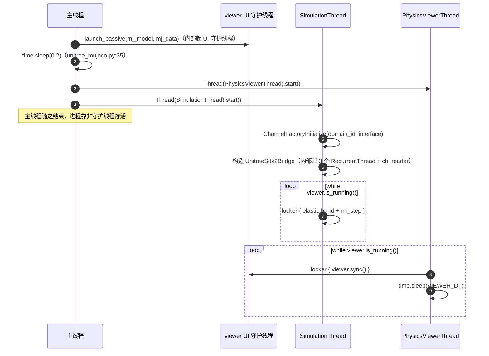
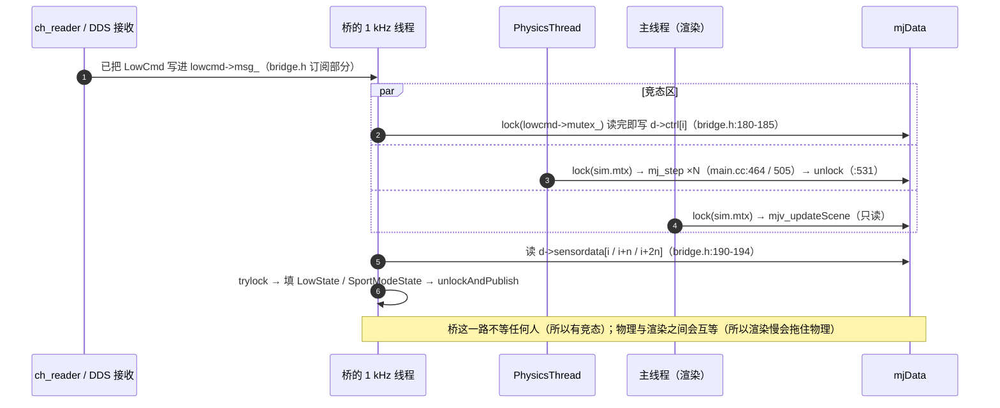
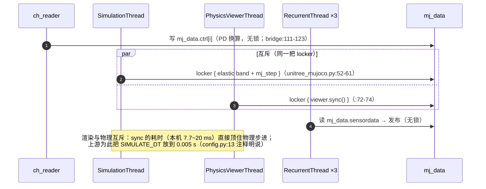
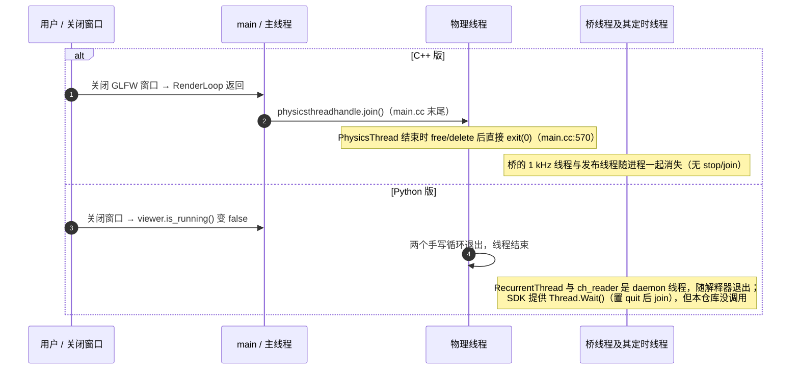
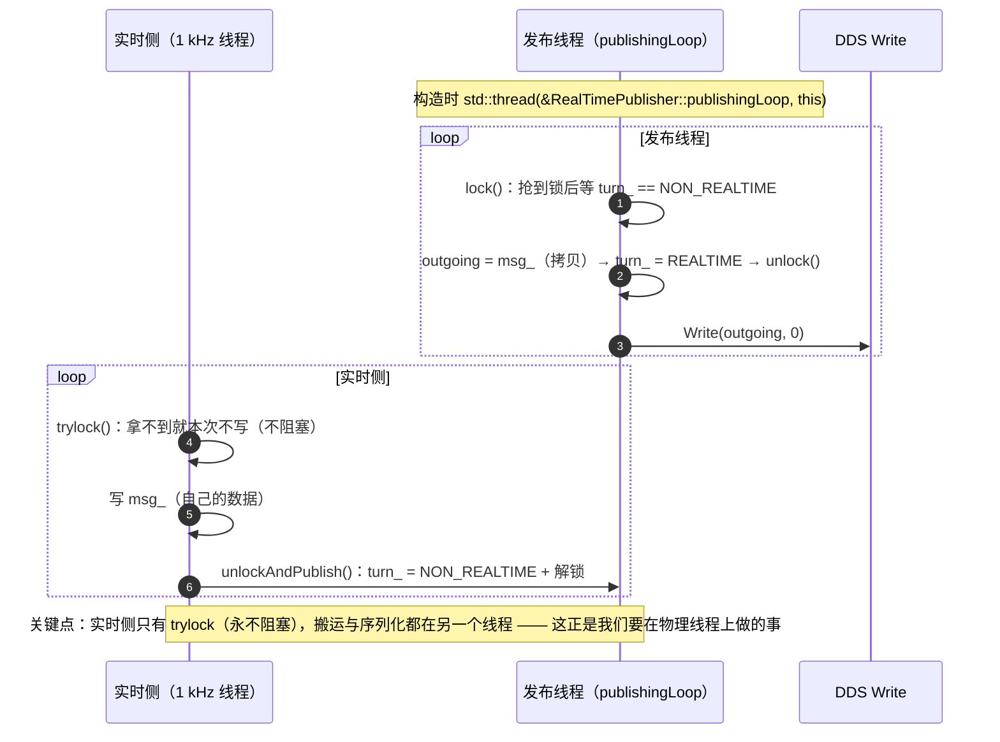

# unitree_mujoco 进程 / 线程 / 通信细节

本文是 [`unitree-mujoco-notes.md`](unitree-mujoco-notes.md) 的展开版：笔记里只留三条业务主干与结论，**所有"完整展开"的图放这里**。引用约定同笔记 —— `文件:行`，路径基线是 `ReadOnly.d/unitree_mujoco`（conda 环境里的头文件写成 `$INC/...`，`unitree_sdk2` / `unitree_sdk2py` 自身的文件写成其仓库内路径，本机未安装故不给行号）。

覆盖范围：**它直接创建或参与管理的进程与线程**。不含操作系统/显卡驱动线程，不含离线工具（`terrain_tool/terrain_generator.py` 只生成 hfield 资源，不参与运行期），不含我们自己的程序。

## 1. 进程与线程总表

```mermaid
flowchart TB
    subgraph CS["进程① C++ 仿真器：./unitree_mujoco"]
        direction TB
        C1["主线程：Simulate::RenderLoop（UI + 渲染）"]
        C2["PhysicsThread：mj_step + 节奏对齐"]
        C3["UnitreeSdk2BridgeThread：等 d 就绪 → 建桥 → 保活"]
        C4["桥的 1 kHz RecurrentThread：ctrl 换算 + 填状态"]
        C5["发布线程 ×3（G1 再 +2）：RealTimePublisher::publishingLoop"]
        C6["（SDK / 中间件内）DDS 接收与发现线程"]
    end
    subgraph PS["进程② Python 仿真器：python3 unitree_mujoco.py"]
        direction TB
        P1["主线程：调 launch_passive，起完两个手写线程即结束"]
        P2["viewer UI 守护线程：launch_passive 内部创建"]
        P3["SimulationThread：建 DDS 桥 + mj_step"]
        P4["PhysicsViewerThread：viewer.sync()"]
        P5["RecurrentThread ×3：lowstate / highstate / wireless"]
        P6["ch_reader 守护线程：LowCmd 队列消费（回调在此）"]
        P7["（中间件内）DDS 接收与发现线程"]
    end
    subgraph CC["进程③④ 控制程序：C++ stand_go2 / Python stand_go2.py"]
        direction TB
        X1["主线程"]
        X2["writebasiccmd 定时线程（仅 C++ 示例）"]
    end
    BUS["DDS 总线：回环网卡 UDP（domain_id 1）<br/>rt/lowcmd ← 控制程序 · 仿真器 → rt/lowstate / rt/sportmodestate / rt/wirelesscontroller"]
    C5 --> BUS
    C6 <--> BUS
    P5 --> BUS
    P6 <--> BUS
    P7 <--> BUS
    BUS --> X1
    X2 --> BUS
```

| 进程 | 谁创建 | 线程清单 | 证据 |
|---|---|---|---|
| ① C++ 仿真器 `./unitree_mujoco` | 用户（`-r`/`-s` 选机器人/场景） | 主线程、`PhysicsThread`、`UnitreeSdk2BridgeThread`、桥的 1 kHz `RecurrentThread`、**每个 publisher 1 个发布线程**、DDS 库内线程 | `main.cc:695`（桥线程）、`:698`（物理线程）、`:701`（RenderLoop）、`bridge.h:170-171`（1 kHz）；发布线程来自 `RealTimePublisher` 构造函数里的 `std::thread(&RealTimePublisher::publishingLoop, this)`（`unitree_sdk2: include/unitree/dds_wrapper/common/Publisher.h`） |
| ② Python 仿真器 `python3 unitree_mujoco.py` | 用户 | 主线程（很快结束）、viewer UI 守护线程、`SimulationThread`、`PhysicsViewerThread`、3 个 `RecurrentThread`、`ch_reader` 守护线程、DDS 库内线程 | `unitree_mujoco.py:38`（SimulationThread）、`:70`（PhysicsViewerThread）；UI 线程见 conda 包里的 `mujoco/viewer.py:575`、`:586`；3 个定时器见 `unitree_sdk2py_bridge.py:63`、`:71`、`:81`；`ch_reader` 见 `unitree_sdk2py/core/channel.py`（`queueLen > 0` 时 `Thread(..., name="ch_reader", daemon=True)`） |
| ③ C++ 控制程序 `example/cpp/stand_go2.cpp` | 用户 | 主线程 + `CreateRecurrentThreadEx("writebasiccmd", …, int(dt*1000000), …)` 定时线程 + DDS 库内线程 | `example/cpp/stand_go2.cpp:98` |
| ④ Python 控制程序 `example/python/stand_go2.py` | 用户 | 只有主线程：`while True` + `time.sleep` 自己节拍 | `example/python/stand_go2.py:53`、`:86` |

三条容易搞错的点：

- **"三线程"只是业务线**（物理 / UI / DDS 桥），不是线程总数。C++ 侧光是 publisher 就再带 3 个线程（`lowstate`、`highstate`、`wireless`；G1 另有 `bmsstate`、`secondary_imu` 两个），再加 SDK 与中间件内部线程，实际线程数 7 个以上。
- **Python 侧的发布没有后台线程**：`ChannelPublisher.Write()` 直接调 `cyclonedds` 写（`unitree_sdk2py/core/channel.py` 的 `__Writer.Write`），周期由 `RecurrentThread` 提供。所以"C++ 有发布线程、Python 没有"是一条真实的结构差异。
- **Python 侧的订阅**因为有队列（`Init(self.LowCmdHandler, 10)`）而多一个 `ch_reader` 守护线程，回调跑在它上面；C++ 侧未逐行核实（见 §10）。

## 2. DDS 接口与消息（两版共用）

| 项 | 值 | 说明 |
|---|---|---|
| 域与网卡 | `domain_id: 1`、`interface: "lo"` | `simulate/config.yaml`；Python 侧 `simulate_python/config.py` 同值 |
| 下行 | `rt/lowcmd` | 每个电机 `{tau, q, dq, kp, kd}`；订阅侧做 PD 换算，物理侧永远只吃力矩 |
| 上行 | `rt/lowstate`、`rt/sportmodestate` | 电机 `q/dq/tau_est` + IMU（桥里顺便算 rpy）；机身位置/速度 |
| 上行（G1 另加） | `rt/lf/bmsstate`、`rt/secondary_imu` | `bridge.h:272`、`:275`；Python 版没有 |
| 手柄 | `rt/wirelesscontroller` | 用 `/dev/input/js0` 的实体手柄顶替真机遥控器（见笔记 §1.1） |
| 时间戳 | `tick = round(d->time / 1e-3)` | `bridge.h:225`，是**仿真时间**而非墙钟 |
| 发布方式 | C++：`RealTimePublisher` 后台线程；Python：调用者直接写 | 见 §9 |

## 3. C++ 仿真器内部：线程、共享数据与锁

| 线程 | 拥有 / 读写什么 | 同步手段 | 证据 |
|---|---|---|---|
| 主线程 `RenderLoop` | 读 `mjData` 组装场景、渲染、处理键鼠 | `sim.mtx` | `simulate.h:86`、`main.cc:701` |
| `PhysicsThread` | `mjModel`/`mjData` 的创建与销毁、`mj_step`、elastic band、噪声、history | `sim.mtx` 包整个循环 | `main.cc:327`、`:538`、`:413`、`:464`、`:505`、`:519`、`:531`、`:498-500` |
| `BridgeThread` | 等 `d`、`ChannelFactory::Init`、选 IDL 建桥、之后空转 | 无（轮询 + `sleep`） | `main.cc:573-617`、`:576-583`、`:598-609`、`:613-615` |
| 1 kHz 线程 | 读写 `mjData`（`ctrl` 与 `sensordata`）、填三种状态消息、读手柄 | 只拿 `lowcmd->mutex_` 与 publisher 的 `trylock` | `bridge.h:170-171`、`:177`、`:180-185`、`:190-194`、`:225` |
| 发布线程 ×N | 复制 `msg_` 并 `Write()` | `mutex_` + `turn_` 原子交接 | `unitree_sdk2: include/unitree/dds_wrapper/common/Publisher.h` |
| DDS 接收（库内） | 把收到的 `LowCmd` 交给回调 | 库内部 | 同上 |

**没有画进图、但要知道的两件事**：① 换模型（UI 拖拽/打开文件）会在物理线程里 `mj_deleteData/Model` 再新建（`main.cc:352-353`、`:382-383`），此时桥手里的裸指针就悬垂了；② 全局变量只有两个裸指针（`main.cc:99-100`），没有任何所有权封装。

## 4. Python 仿真器内部：线程、共享数据与锁

| 线程 | 拥有 / 读写什么 | 同步手段 | 证据 |
|---|---|---|---|
| 主线程 | 建 viewer、启动两个手写线程 | 无 | `unitree_mujoco.py:79-83`（`__main__` 块） |
| UI 守护线程 | GLFW 事件与绘制 | 库内部 | `mujoco/viewer.py:575`、`:586` |
| `SimulationThread` | 初始化 DDS 桥、`mj_step`、elastic band | `locker` | `unitree_mujoco.py:38`、`:52-61` |
| `PhysicsViewerThread` | `viewer.sync()` 与节流睡眠 | 同一把 `locker` | `unitree_mujoco.py:70`、`:72-74` |
| `RecurrentThread` ×3 | 读 `sensordata` 填消息并发布 | publisher 自身（无后台线程） | `unitree_sdk2py_bridge.py:63`、`:71`、`:81` |
| `ch_reader` | 消费队列并调用 `LowCmdHandler` → 写 `mj_data.ctrl[i]` | 无（拿不到 `locker`） | `unitree_sdk2py_bridge.py:111-123`、`unitree_sdk2py/core/channel.py` |
| DDS 接收（库内） | `on_data_available` → 入队 | 库内部 | 同上 |

与 C++ 版的两条结构差异：**① 发布没有后台线程**（少 3 个线程）；**② 多一个 `ch_reader`**（多 1 个线程）。净效果是线程数接近，但**回调跑在哪个线程上不同**，这是分析竞态时最容易被忽略的一点。

## 5. 启动握手时序

C++ 版（`main` 先把三个线程拉起来，靠轮询对齐顺序）：

Python 版（没有轮询握手，靠固定 `time.sleep(0.2)` 让 viewer 先起来）：

## 6. 稳态一步时序（细节版）

C++ 版：三边同时碰 `mjData`，而且**桥那一路不认 `sim.mtx`**。

Python 版：一把 `locker` 把 `mj_step` 与 `viewer.sync()` 串起来，而控制写入在 `ch_reader` 上、拿不到这把锁。

## 7. 退出 / 停止时序

| 收尾动作 | C++ | Python |
|---|---|---|
| 物理循环退出条件 | `sim.exitrequest` / 窗口关闭 | `while viewer.is_running()` |
| 停止信号 | 无统一的 `stop()`，靠 `exit(0)` | 自己的 `__quit` 标志 / daemon 退出 |
| 已存在的优雅路径 | `~RealTimePublisher()` 会 `stop()` 并 `join()` 发布线程 | `Thread.Wait(timeout)`（未被调用） |
| 证据 | `main.cc:570`、Publisher.h | `unitree_mujoco.py:49`、`:71`、`unitree_sdk2py/utils/thread.py` |

## 8. 我们的目标设计（简版，详版见笔记 §8）

笔记 §8 那张图就是结论，这里只补一句衔接：**上游其实已经用过我们想要的模式** —— `RealTimePublisher` 的 `trylock()` / `turn_` / `publishingLoop` 就是 ROS `realtime_tools` 的"实时侧只交接、非实时线程负责真正发送"，等价于"双缓冲 + 谁负责搬运"。我们把它推广到**三个方向**（控制输入、状态快照、渲染读取），并把"谁占哪块内存"写成职责表。

## 9. 上游的双缓冲先例：`RealTimePublisher`

## 10. 待核实与复核方法

| 待核实项 | 现状 | 怎么核 |
|---|---|---|
| **C++ 侧 `LowCmd` 回调跑在哪个线程**（DDS 接收线程？还是 SDK 的 reader 线程？） | 本机未安装 `unitree_sdk2`（`/opt/unitree_robotics` 不存在），GitHub 抓取 `include/unitree/dds_wrapper/common/Subscription.h` 失败，故**未逐行核实**；图中暂写作"库内部" | 装好 SDK 后读 `unitree_sdk2/include/unitree/dds_wrapper/common/Subscription.h` 与 `channel.hpp` 的实现，确认 `CreateRecvChannel` 是回调直调还是另有 reader 线程 |
| C++ publisher 的数量随机型变化（Go2 3 个，G1 5 个） | 已核实类层次，未数 G1 的完整清单 | 数 `bridge.h` 里 `G1Bridge` 构造的元素 |
| Cyclone DDS 内部线程个数 | 随实现/配置而异，**不属于本仓库设计** | 需要时以 `cyclonedds` 文档为准，图中统一写"库内部" |

## 11. 与笔记的分工

| 内容 | 位置 |
|---|---|
| 三条业务主干、结论清单、API 差异、问题清单、目标设计 | [`unitree-mujoco-notes.md`](unitree-mujoco-notes.md) |
| 进程/线程全展开（本文件 §1、§3、§4）、消息与 DDS 接口（§2）、启动/稳态/退出时序（§5-§7）、SDK 先例（§9）、待核实清单（§10） | 本文 |
